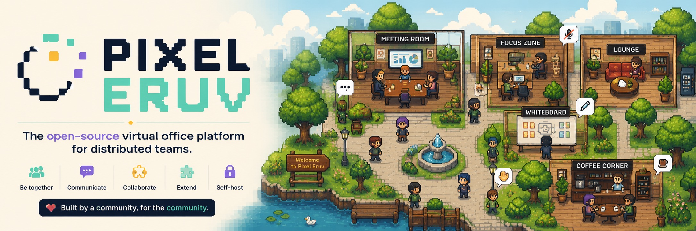

# Pixel Eruv

## The open-source virtual office platform

Pixel Eruv is an open-source platform for building persistent, pixel-art virtual workspaces where distributed teams can meet, collaborate, and communicate naturally.

Inspired by platforms like Gather, ZEP and WorkAdventure, but designed from the ground up as a modern, extensible platform, Pixel Eruv combines the familiarity of a top-down multiplayer world with enterprise collaboration tools.

Instead of switching between chat applications, video meetings and shared documents, teams interact inside a shared virtual office where communication is driven by proximity and collaboration happens naturally.

✨ Features (MVP)

* 🗺️ Persistent multiplayer pixel-art worlds (single world per deployment)
* 🎙️ Proximity-based audio and video powered by LiveKit
* 💬 Real-time chat and presence (PocketBase-backed)
* 🏢 Offices and maps within a world
* 🔐 Authentication via PocketBase (email/password, email verification, OAuth2 social login)
* 🎨 Tiled map support
* 🔌 Extension system — add NPCs, custom behaviors, and objects as separate programs in any language
* ⚡ High-performance Go backend
* 🌐 Self-hostable via Docker Compose (no Kubernetes required)
* 🔍 Audit log + observability — searchable audit event history (HTMX UI) + OpenTelemetry traces (motel dev / OpenObserve optional)
* 🔐 Admin portal — unified email/password login via PocketBase, protects PB admin + audit UI behind a single auth gate

🧭 Roadmap (post-MVP)

* 🤖 AI assistants and NPC agents (built on the extension system)
* 🏢 Multi-organization support (organizations → worlds → maps)
* 💬 Matrix Synapse chat (federation, rich clients, E2EE)
* 🌱 Plant growth, user inventories, owned workplaces, whiteboard objects

🏗️ Architecture

Pixel Eruv is built around a server-authoritative architecture inspired by modern multiplayer games.

The backend is responsible for world simulation, entity replication, permissions and persistence, while the frontend combines a Phaser 4 renderer for the virtual world.

Audio, video and screen sharing are delegated to LiveKit, allowing the simulation engine to remain focused on the virtual environment.

Core technologies include:

* Go for backend services
* Phaser 4 for world rendering
* LiveKit for media
* Protocol Buffers for networking
* PocketBase for durable data (users, world config, audit logs)
* NATS for internal event distribution and reactive state
* SeaweedFS / RustFS for asset storage

🚀 Philosophy

Pixel Eruv is not just another Gather clone.

It is a platform for building spatial collaboration applications.

The virtual office is only one possible client. The same backend can power desktop applications, mobile clients, AI agents, accessibility-focused interfaces, or entirely different visualizations of the same shared world.

By separating simulation, communication and presentation, Pixel Eruv aims to become the open foundation for the next generation of collaborative software.

🛠️ Getting Started

The lite MVP runs a single world: NATS for the bus, a Pusher (WebSocket proxy),
a World Simulator (authoritative tick loop + replication), and a Phaser
frontend served by nginx. Two ways to run it:

> **Deploying to a server?** See [`docs/quick-start.md`](docs/quick-start.md) —
> a step-by-step admin guide covering copying `dist/` to a remote host, TLS
> via a host nginx proxy, login credentials, and map design/upload.

Prerequisites

* Docker and Docker Compose (for the bundled path), or
* Go 1.26+, Node 22+, and a NATS server (for the native/dev path)

💾 Requirements

Software:

* Docker 24+ and Docker Compose v2 (bundled path), or
* Go 1.26+, Node 22+, protoc + buf (native/dev path), plus a NATS server
* A LiveKit instance (bundled in the Docker stack) for A/V meetings
* ffmpeg — only required inside the `ext-rec` container for audio extraction
  (already included in the `ext-rec` Docker image; no host install needed)

Disk space (production deployment, all-Docker):

| Component | Approx. size |
|---|---|
| Docker images (10 backend + 1 frontend + LiveKit + Egress + NATS + Redis + PocketBase + Mailhog) | ~2.5 GB |
| PocketBase data volume (`pb_data`) | grows with users/maps; ~50 MB for a small team |
| Audit data volume (SQLite) | grows with events; ~10-100 MB/year for a small team |
| Recordings volume (`/opt/pixeleruv/recordings`) | **unbounded** — ~1 MB/min for MP4 + ~0.1 MB/min for MP3 at q:a 2. A 1h meeting is ~60 MB MP4 + ~6 MB MP3. Monitor via the disk usage indicator on `/admin/recordings` (turns red below 5% free). |
| Backups (`/opt/pixeleruv/backups`) | one tarball per deploy per volume; prune manually |

**Plan for at least 5 GB free** for a fresh deployment (images + headroom),
plus whatever your recording retention policy requires. Recordings are the
main growth driver — there is no auto-prune; admins must delete via
`/admin/recordings` or cron a cleanup of the bind-mounted directory.

Memory:

* ~1.5 GB RAM for the base stack (NATS, PocketBase, pusher, worldsim, extensions, LiveKit).
* Add ~512 MB per concurrent A/V meeting participant for LiveKit media.
* Add ~256 MB per concurrent ffmpeg audio extraction (capped at 2 by default).

Bundled (Docker Compose)

    make up

This builds the Pusher and World Sim images, starts NATS, and serves the
frontend with nginx. Open http://localhost:4080 — you should see a 20×20
tile world. Move with the arrow keys; each browser tab is a player.

For remote access the same compose file also exposes HTTPS on port `4043`
with a self-signed cert generated at startup. Set `PUBLIC_HOST` to the host's
LAN IP or hostname and rebuild — one variable drives the TLS cert SAN, the
email verification URL (`APP_URL`), and the LiveKit public URL:

    PUBLIC_HOST=192.168.1.10 make up

Then open `https://192.168.1.10:4043` and accept the self-signed cert warning
once. See the [Quick Start for Admins](docs/quick-start.md) for putting a real
TLS certificate and a host nginx proxy in front.

To stop: `make down`. To tail logs: `make logs`.

Self-contained `dist/` (no source needed on the host)

    make dist-x86    # linux/amd64 — for Docker deployment on a server
    make dist-macos  # darwin/arm64 — for native macOS execution

This stages pre-built binaries, web assets, Dockerfiles, compose,
nginx.conf, livekit.yaml, and PocketBase migrations into
`dist/`. Copy the whole `dist/` directory to another machine and run:

    docker compose -f dist/docker-compose.yml up --build

The frontend is served on `http://<host>:4080` (HTTP) and `https://<host>:4043`
(HTTPS, self-signed). For remote browsers, set `PUBLIC_HOST=<host-ip>` and use
the HTTPS endpoint — the auth flow needs a secure context. See the
[Quick Start](docs/quick-start.md) for putting a real TLS certificate in front.

Native binaries + dev server

Build the backend and frontend:

    make build      # → dist/bin/pusher, dist/bin/worldsim
    make web        # → dist/web/

Start a NATS server (e.g. `docker run -p 4222:4222 nats:2.10-alpine -js`),
then run the two binaries against it:

    NATS_URL=nats://localhost:4222 ./dist/bin/worldsim &
    NATS_URL=nats://localhost:4222 WS_ADDR=:8081 ./dist/bin/pusher &

For frontend development with hot reload, use the Vite dev server (it proxies
`/ws` to the Pusher on :8081):

    cd frontend && npx vite

Open http://localhost:5173.

To serve the built frontend natively instead, point an nginx instance at
`dist/web/` with `docker/nginx.conf` (change the `proxy_pass` upstream
from `pusher:8081` to `127.0.0.1:8081` for a non-Docker host).

🎙️ LiveKit node IP

* Dev (now): `LIVEKIT_NODE_IP` unset → defaults to `127.0.0.1` → works because
  Docker maps ports to your host.
* Production: set `LIVEKIT_NODE_IP=<your-public-ip>` (env var or `.env` file) →
  LiveKit advertises that IP in ICE candidates → browsers on the internet can
  route media back to it.

🌐 Remote access (`PUBLIC_HOST`)

A single env var drives everything remote browsers need:

| Var | Default | Purpose |
|-----|---------|---------|
| `PUBLIC_HOST` | `localhost` | Host IP/hostname remote browsers use to reach the stack |

Setting it auto-configures three things:

1. **TLS cert SAN** — `frontend-entrypoint.sh` appends `PUBLIC_HOST` to the
   self-signed cert's `subjectAltName` so browsers trust `https://<PUBLIC_HOST>:4043`.
2. **Email verification URL** — `APP_URL` defaults to
   `https://<PUBLIC_HOST>:4043`, so verification and password-reset emails
   link to the correct public URL.
3. **LiveKit public URL** — `LIVEKIT_PUBLIC_URL` becomes
   `ws://<PUBLIC_HOST>:7880` so the browser's LiveKit SDK can reach the SFU.

For LAN testing:

    PUBLIC_HOST=192.168.1.10 docker compose -f docker/docker-compose.yml up --build

Then open `https://192.168.1.10:4043` and accept the self-signed cert warning
once. For a real domain + Let's Encrypt cert, put a host nginx proxy in front
(see [`docs/quick-start.md`](docs/quick-start.md)).

� LiveKit API secret

LiveKit rejects secrets shorter than 32 characters. The dev config ships with
a 40-char placeholder (`devsecretdevsecretdevsecretdevsecret123`) set in both
`docker/livekit.yaml` (under `keys:`) and `docker/docker-compose.yml`
(`LIVEKIT_API_SECRET` on `ext-av`). The two **must match** — `ext-av` signs
join tokens with this secret and LiveKit verifies them.

For anything beyond local dev, generate a fresh secret and replace it in both
files:

    openssl rand -hex 32

After rotating the secret, restart `livekit` and `ext-av`, and have any
connected browser rejoin the room (old tokens are signed with the old secret
and will fail with `token signature is invalid` until refreshed).

�🔍 Debugging with motel

The backend (pusher, worldsim, all four extensions) and frontend are
instrumented with OpenTelemetry traces and logs. Telemetry is **off by
default**; flip it on when you want runtime evidence while debugging.

**Dev** uses motel (a local TUI collector). For production, OpenObserve
can be added to the Docker stack on CPUs with AES-NI support — see the
[FAQ](documentation/FAQ.md#openobserve-keeps-restarting-exit-code-132)
for details.

motel is a local OpenTelemetry collector with a query API and TUI. Install it
from [github.com/kitlangton/motel](https://github.com/kitlangton/motel).

Quick start (one command):

    make build          # one-time: build the Go binaries
    make debug          # starts NATS + motel + pusher + worldsim with OTel on

This starts a standalone NATS container, ensures motel is running, then
launches both Go services with `OTEL_ENABLED=true`. Ctrl-C stops the
services and cleans up NATS. For the frontend with browser traces:

    make debug-frontend   # in a second terminal: Vite dev server + OTel

Open http://127.0.0.1:27686 for the motel TUI, or http://localhost:5173
for the game.

Or run them manually — start motel once (it runs as a machine-global
daemon, shared across projects):

    motel start

Then run the services with `OTEL_ENABLED=true`, pointing at motel's default
OTLP/HTTP endpoint:

    OTEL_ENABLED=true \
    OTEL_EXPORTER_OTLP_ENDPOINT=http://127.0.0.1:27686 \
    NATS_URL=nats://localhost:4222 ./dist/bin/worldsim &

    OTEL_ENABLED=true \
    OTEL_EXPORTER_OTLP_ENDPOINT=http://127.0.0.1:27686 \
    NATS_URL=nats://localhost:4222 WS_ADDR=:8081 ./dist/bin/pusher &

For the frontend, set the Vite env vars at build/dev time:

    cd frontend
    VITE_OTEL_ENABLED=true \
    VITE_OTEL_ENDPOINT=http://127.0.0.1:27686/v1/traces \
    npx vite

Open http://127.0.0.1:27686 for the motel TUI, or query the API directly:

    curl "http://127.0.0.1:27686/api/traces/search?service=worldsim&operation=apply_input"
    curl "http://127.0.0.1:27686/api/logs/search?service=worldsim&body=tick"

What you get:

* Cross-service traces — a `traceparent` header carries span context through
  NATS, so one trace spans `pusher.nats.publish.input → worldsim.apply_input`
  and `worldsim.tick → worldsim.replicate → pusher.ws.write_replication`.
* Browser → backend link — the frontend stamps a W3C `traceparent` into each
  `AuthFrame`/`InputFrame`, so `ws.send_input → pusher.nats.publish.input →
  worldsim.apply_input` share one trace id.
* Tick metrics as logs — `worldsim.tick` emits a structured log per tick with
  `duration_ms`, `entity_count`, `replicated_clients`, and `snapshot_seq`
  attributes (motel has no metrics endpoint, so these ride on logs/spans).

Env vars:

| Var | Default | Purpose |
|-----|---------|---------|
| `OTEL_ENABLED` | `false` | Arm the Go exporters (`true`/`1`/`yes`) |
| `OTEL_EXPORTER_OTLP_ENDPOINT` | `http://127.0.0.1:27686` | OTLP base URL |
| `OTEL_SERVICE_NAME` | caller-provided | Override `service.name` |
| `OTEL_TRACES_SAMPLE_RATIO` | `1.0` | TraceIDRatio sampler (0.0–1.0) |
| `VITE_OTEL_ENABLED` | `false` | Arm the frontend exporter |
| `VITE_OTEL_ENDPOINT` | `http://127.0.0.1:27686/v1/traces` | Frontend OTLP traces URL |
| `VITE_OTEL_SERVICE` | `pixeleruv-frontend` | Frontend `service.name` |

When telemetry is disabled, the Go services use a no-op tracer/logger and the
frontend registers no provider — zero overhead.

📋 Audit log

A standalone audit service records lifecycle and interaction events (player
connections, bans, chat messages, zone transitions, map reloads, extension
registrations, A/V tokens) to its own SQLite database and serves a searchable
web UI at `/audit/`. The `/audit/world` page shows live world state: per-map
overview, connected players (linked to their events), zone occupancy, and
extension status. Each audit event carries an optional trace ID linking to
the corresponding OpenObserve trace — audit tells you *what* happened, OTel
tells you *why*. See the
[audit & observability design](documentation/plans/2026-07-12-audit-observability-design.md)
for the full event catalog and storage upgrade path.

🔐 Admin portal

A standalone Go service (`backend/cmd/admin`) provides email/password login
via PocketBase and a signed cookie session. nginx uses `auth_request` to
protect PB admin (`/_/`) and the audit UI (`/audit/`) — log in once at
`/admin/` and access all admin services without re-authenticating. Only users
with `is_admin=true` in PocketBase can log in. A public welcome page at
`/welcome` provides community-customizable landing content.

Project layout

    proto/                  Protobuf definitions (frames, replication, components)
    backend/cmd/pusher      WebSocket ↔ NATS proxy (no game logic)
    backend/cmd/worldsim    Authoritative simulation: tick loop, ECS, movement, replication
    backend/cmd/audit       Audit log service (NATS sub + SQLite + HTMX UI)
    backend/cmd/admin       Admin portal (email/password login + auth_request endpoint)
    backend/internal/audit  Audit event types + Emit helper (shared by all services)
    frontend/               Phaser 4 client + generated TS protobuf
    docker/                 Dockerfiles for pusher, worldsim, frontend
    dist/
      bin/                  Native binaries (build output)
      web/                  Frontend build output + map assets
      sprites/              Character spritesheets (worldsim auto-seeds sprite_bases)
      maps/                 Default Tiled map + tileset PNGs (worldsim auto-seeds the maps record)
      docker/               Dockerfiles, nginx.conf, livekit.yaml
      docker-compose.yml    Self-contained compose (run from dist/)
      pb_migrations/        PocketBase collection schemas

🌱 Project Status

Pixel Eruv is currently in active design and early development.

Contributions, ideas, discussions and architectural feedback are welcome as the project evolves.

📚 Documentation

The project documentation lives in [`documentation/`](documentation/). Start
with the [system overview](documentation/00-system-overview.md) for the big
picture, then dive into the detailed specs:

* [00 — System overview](documentation/00-system-overview.md) — high-level architecture, start here
* [01 — Vision and goals](documentation/01-vision-and-goals.md) — project purpose and MVP scope
* [02 — Functional requirements](documentation/02-functional-requirements.md) — what the system must do
* [03 — Non-functional requirements](documentation/03-non-functional-requirements.md) — scale, latency, availability targets
* [04 — Tech stack](documentation/04-tech-stack.md) — technology choices and rationale
* [05 — Architecture](documentation/05-architecture.md) — detailed component wiring and data flows
* [06 — Data model and persistence](documentation/06-data-model-and-persistence.md) — where data lives and why
* [07 — Network protocol](documentation/07-network-protocol.md) — WebSocket frames and NATS subjects
* [08 — Authentication and identity](documentation/08-auth-and-identity.md) — PocketBase auth, tokens, identity mapping
* [09 — Pusher](documentation/09-pusher.md) — WebSocket proxy service
* [10 — World Simulator](documentation/10-world-simulator.md) — authoritative simulation service
* [11 — Replication](documentation/11-replication.md) — how game state reaches clients
* [12 — Netcode](documentation/12-netcode.md) — prediction, reconciliation, interpolation *(skeleton)*
* [13 — ECS design](documentation/13-ecs-design.md) — entity-component-system rationale and decisions
* [14 — Zones and interactions](documentation/14-zones-and-interactions.md) — zones, knock-to-join, AOI *(partial)*
* [15 — Maps and Tiled](documentation/15-maps-and-tiled.md) — map authoring and layering *(skeleton)*
* [16 — Avatars](documentation/16-avatars.md) — avatar composition and bubbles *(skeleton)*
* [17 — Chat](documentation/17-chat.md) — text chat (PocketBase-backed)
* [18 — Extensions](documentation/18-extensions.md) — peer-simulator extension system
* [19 — LiveKit](documentation/19-livekit.md) — audio/video integration
* [20 — Roadmap](documentation/20-roadmap.md) — MVP and post-MVP phases
* [A1 — Why Phaser 4](documentation/A1-why-phaser.md) — engine choice rationale (appendix)
* [A2 — Existing applications](documentation/A2-existing-applications.md) — prior-art survey (appendix)

🤝 Contributing

Pixel Eruv is an open-source community project.

Whether you’re interested in Go, Phaser, networking, distributed systems, game development, UI/UX or documentation, contributions are welcome.

Together, let’s build the open infrastructure for spatial collaboration.
