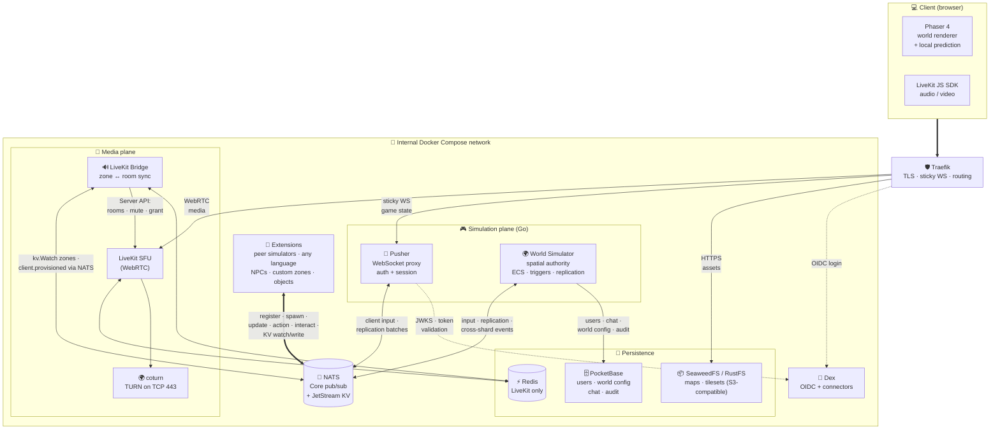

# System Overview

This document is the **entry point** to the Pixel Eruv documentation. It gives
a high-level picture of what the system is, how the major pieces fit together,
and the principles behind the design. Each section links to the detailed
document that goes deeper.

> If you only read one document, read this one. If you need to implement or
> wire a specific component, follow the links to the detailed specs.

---

## 1. What is Pixel Eruv?

Pixel Eruv is an open-source, self-hostable **pixel-art virtual office** — a
top-down multiplayer world where remote teams can meet, move around, and hold
spatial video/audio conversations, all in the browser.

It is in the same category as Gather.town, ZEP, and Workadventu/re, but with
three differences:

- **Open source and self-hostable** — deployable with Docker Compose only, no
  Kubernetes required.
- **Modular by design** — built on an Entity-Component-System (ECS) core so
  new object types, triggers, and AI behaviours can be added without forking
  the engine.
- **Enterprise-ready identity** — authentication via Dex (OIDC), federating to
  LDAP, Active Directory, Google, GitHub, etc.

See `01-vision-and-goals.md` for the full vision and MVP scope.

---

## 2. The big picture

Everything reaches the outside world through a single reverse proxy
(**Traefik**). Inside the internal Docker Compose network, services
communicate exclusively through **NATS** (the bus) — there is no direct
service-to-service RPC. The simulation plane is split into two Go services
(**Pusher** + **World Simulator**), with **Extensions** as first-class peer
simulators on the same bus.



> **SVG version:** [`overall-architecture.svg`](overall-architecture.svg) — a
> high-resolution, color-coded rendering of the full system (suitable for
> presentations and zooming). The Mermaid diagram above is the canonical
> source; the SVG is a static rendering of the same topology.

### Planes at a glance

| Plane | Responsibility | Key components |
|---|---|---|
| **Client** | Render the world, capture input, play audio/video | Phaser 4, LiveKit JS SDK |
| **Edge** | TLS termination, routing, WebSocket stickiness | Traefik |
| **Simulation** | WebSocket I/O + auth (Pusher); spatial authority, ECS, triggers, replication (World Sim); gameplay behavior (Extensions) | Pusher (Go), World Simulator (Go), Extension processes |
| **Extensions** | Peer simulators driving entity behavior (NPCs, custom zones, objects) — any language with a NATS client | Per-extension processes |
| **Bus** | Ephemeral pub/sub (Core NATS) and reactive semi-persistent state (JetStream KV) | NATS |
| **Media** | Real-time audio/video relay, zone-scoped room management, TURN fallback | LiveKit SFU, LiveKit Bridge, coturn |
| **Persistence** | Durable relational data, asset storage, LiveKit-only shared state | PocketBase, SeaweedFS/RustFS, Redis |
| **Identity** | Issue and validate OIDC tokens | Dex |

### Reading the diagram

- **Bold arrows** (`==>`) are client-side TLS-terminated channels (WebSocket,
  WebRTC, HTTPS).
- **Solid arrows** (`-->`) are internal service-to-service flows.
- **Dotted arrows** (`-.->`) are out-of-band trust/validation (the browser
  goes to Dex directly for login; the Pusher fetches JWKS from Dex to
  validate tokens).
- **NATS in the center** is intentional: every backend service talks through
  NATS, not to each other directly. This is the system's most important
  architectural property.
- **Redis is isolated to LiveKit** — it must not be used for any other state
  (see `04-tech-stack.md`).

---

## 3. The six core components

### Pusher — the WebSocket proxy

The Pusher is a Go service that sits between the browser's WebSocket and NATS
Core. It is deliberately thin: it handles WebSocket I/O, validates the OIDC
token at the connection boundary, and forwards client input and replication
batches between the browser and the World Simulator via NATS.

- Validates the OIDC token on connection (JWKS cache — see
  `08-auth-and-identity.md`).
- Manages session state (which `client_id` is on which WebSocket).
- Publishes client input and connect/disconnect events to NATS Core.
- Subscribes to per-client replication batches from the World Simulator and
  forwards them to the client.
- **Does not** run the ECS, spatial index, trigger registry, AOI, or replication encoding. **Does
  not** access PocketBase or JetStream KV.
- Can be horizontally scaled; Traefik sticky sessions route reconnecting
  clients to the same instance.

See `09-pusher.md` for the full specification.

### World Simulator — the spatial authority and replication gateway

The World Simulator is a Go service that **is the spatial authority and
replication gateway**. It owns the tile grid, the spatial index, the trigger
registry, the zone boundaries, and the replication pipeline. Its only gameplay
system is player avatar movement; all other gameplay behavior is delegated to
extensions via NATS. It is the only service that accesses PocketBase and
JetStream KV.

- Hosts the authoritative ECS (Ark) — see `13-ecs-design.md`. All entities live
  in the same ECS.
- Owns the spatial index (tile → triggers, tile → entities), the trigger
  registry, and the zone boundary registry. Evaluates access triggers
  (block/allow cached, ask routed to extensions) and dispatches event triggers
  (notify).
- Moves player avatars (the only in-kernel gameplay system — latency-critical
  and deployment-invariant). All other entity behavior comes from extensions
  via NATS.
- Computes the area-of-interest (AOI) per client and encodes component-based
  replication batches — see `11-replication.md`.
- Reads/writes semi-persistent state (player positions, player status, zone
  state) in JetStream KV; reads/writes durable data (users, world config) in
  PocketBase.
- Can be sharded per map or per region; cross-shard entity visibility is
  handled via Core NATS pub/sub.

See `10-world-simulator.md` for the full specification.

### Extensions — peer simulators

Extensions are external processes (in any language with a NATS client) that
act as **peer simulators** alongside the World Simulator. They have the same
entity management capabilities as the World Sim's kernel — there is no
artificial distinction. The World Sim's role is spatial authority and
replication gateway; extensions own all gameplay behavior for non-player
entities.

- Register with the World Sim via NATS, spawn entities in the ECS (no type
  restrictions).
- Register triggers (access: block/allow/ask; event: notify; action: click)
  on tiles and entities. The kernel caches block/allow triggers locally,
  routes ask triggers to the extension at runtime, and validates range/LOS
  for action triggers before dispatching.
- Register zones (polygon regions with associated triggers). Zone boundaries
  are stored in the kernel; zone behavior is implemented by the extension via
  triggers.
- Update any component directly (per-tick or event-driven) — same mechanism
  as the World Sim's kernel. Target-based interpolated movement is also
  available as a convenience.
- Register **custom component types** with new protobuf schemas.
- Handle **client interactions** asynchronously (e.g. LLM calls).
- Read and write **JetStream KV** directly (unrestricted — same access as the
  World Sim).
- Any language: Python (LangChain), Go, Rust, Node — anything that speaks
  NATS.

See `18-extensions.md` for the full specification.

### NATS — the nervous system

NATS serves two distinct roles:

- **Core NATS** (ephemeral, in-memory pub/sub) — high-frequency volatile data:
  player movements, transient events. Not persisted.
- **JetStream KV** (semi-persistent) — reactive state that must survive a
  World Simulator restart: zone properties, user positions, user status, world
  globals.
  Supports `kv.Watch` (instant push to watchers), CAS (atomic concurrent
  writes), and revision history (audit trail).

The split is deliberate: per-tick movement data would overwhelm JetStream, so
it stays in Core NATS. State that matters across restarts goes to JetStream KV.

### LiveKit + LiveKit Bridge — the media plane

**LiveKit** is the WebRTC SFU that relays audio and video. The browser connects
to it directly (via the LiveKit JS SDK) for media — the Pusher never proxies
media traffic.

The **LiveKit Bridge** is a Go service that keeps LiveKit rooms in sync with
the simulation's zone state. It watches JetStream KV for zone changes and
translates them into LiveKit actions: create/destroy rooms, mute/unmute
participants, grant/revoke subscriptions. This is how **audio/video isolation**
for exclusive zones is enforced — people outside a closed-door zone cannot hear
or see what's inside.

**coturn** provides TURN relay on TCP 443 for users behind corporate firewalls
that block UDP.

**Redis** is used **only** by LiveKit and the Bridge to share active-room and
participant state. It is not used anywhere else in the application.

### PocketBase — the durable store

PocketBase is the single source of truth for data that must survive
indefinitely and has a relational shape: user profiles, avatar appearance,
world configuration, map references, and the audit log.

It runs as a standalone Docker Compose service. The World Simulator talks to
it over HTTP. Written rarely, read on login.

See `06-data-model-and-persistence.md` for the full schema.

### Dex — the identity provider

Dex is an OIDC federation bridge. It accepts credentials from any configured
upstream (LDAP, Microsoft OIDC, SAML, GitHub, local password) and issues
standard OIDC JWTs. The rest of the application only ever sees Dex-signed
tokens.

The MVP ships with Dex's **local-password connector** enabled. Enterprise
connectors are enabled later by changing Dex's config at deploy time — no
application code changes.

See `08-auth-and-identity.md` for token lifecycle, validation, and flows.

---

## 4. Three data flows (simplified)

### A. A user connects and joins the world

```
Browser → Traefik → Pusher (WebSocket)
         ↳ browser authenticates with Dex, gets JWT
         ↳ Pusher validates JWT (JWKS), extracts sub
         ↳ Pusher publishes client.connected to NATS
         ↳ World Simulator receives event:
            • looks up / creates user in PocketBase
            • restores last position from JetStream KV
            • registers entity in ECS, computes initial snapshot
            • publishes replication batch to NATS
         ↳ Pusher forwards snapshot to browser
         ↳ World Sim publishes client.provisioned to NATS Core
         ↳ Bridge issues LiveKit token → publishes to client.<client_id>.control → Pusher forwards to Browser
         ↳ Browser connects to LiveKit SFU for audio/video
```

### B. A user closes a door (activates an exclusive zone)

```
Browser → Pusher: ActionFrame (click door tile)
         ↳ Pusher forwards input to NATS
         ↳ World Simulator receives ActionFrame:
            • no action trigger on tile → fallback to entity interaction routing
            • forwards interaction to the owning extension (e.g. doors extension). The extension updates the door component, writes zone state to KV, and may register/unregister block triggers on the zone boundary tiles.
            • encodes replication batch (zone state change)
            • publishes batch to NATS → Pusher → clients (visual filter)
         ↳ NATS kv.Watch fires:
            • Bridge → LiveKit: cut A/V subscriptions for outsiders
```

### C. A user moves (every tick)

```
Browser → Pusher: input
         ↳ Pusher forwards input to NATS
         ↳ World Simulator receives input:
            • runs player avatar movement (in-kernel): computes target tile, evaluates access triggers (block/allow cached, ask routed to extension), updates position if allowed, fires event triggers (notify) on entered/exited tiles
            • encodes per-client replication batches (AOI-filtered)
            • publishes batches to NATS
         ↳ Pushers forward batches to their connected clients
         ↳ Clients interpolate remote avatars (snapshot LERP)
```

---

## 5. Design principles

1. **Server-authoritative.** The World Simulator is the spatial authority: it
   owns the tile grid, the trigger registry, and the zone boundaries. The client
   predicts locally and reconciles; it never decides authoritative state. Zone
   isolation is enforced server-side via triggers, not client-side.

2. **One job per store.** Three persistence layers, each with a distinct
   access pattern:
   - PocketBase — durable, relational, written rarely.
   - JetStream KV — reactive, semi-persistent, written every session.
   - Core NATS — ephemeral, in-memory, written every tick.
   No store overlaps another's responsibility.

3. **Separation of simulation and media.** The World Simulator handles game
   state; the LiveKit SFU handles audio/video. They coordinate through the
   Bridge and NATS, never by proxying each other's traffic.

4. **Modular by ECS.** Data and logic are strictly separated. New behaviours
   are new components + new extensions, not new subclasses or kernel
   modifications. The kernel's only gameplay system is player avatar movement;
   everything else is an extension registered via NATS. This keeps the engine
   extensible for NPCs, triggers, and dynamic object characteristics.

5. **Self-hostable, no Kubernetes.** The entire stack runs on Docker Compose.
   A small IT team can deploy and operate it without a platform-engineering
   budget.

6. **Identity is the root of trust.** Every action is traced back to an OIDC
   `sub` → entity ID → zone membership → permissions. No anonymous game-state
   access.

---

## 6. Where to go next

| If you want to understand… | Read |
|---|---|
| The project vision and MVP scope | `01-vision-and-goals.md` |
| What the system must do (features) | `02-functional-requirements.md` |
| Scale, latency, availability targets | `03-non-functional-requirements.md` |
| Technology choices and rationale | `04-tech-stack.md` |
| Detailed component wiring and data flows | `05-architecture.md` |
| Where each piece of data lives and why | `06-data-model-and-persistence.md` |
| WebSocket frames and NATS subject conventions | `07-network-protocol.md` |
| Authentication, tokens, and identity | `08-auth-and-identity.md` |
| Pusher (WebSocket proxy) | `09-pusher.md` |
| World Simulator (spatial authority + replication gateway) | `10-world-simulator.md` |
| How state is replicated to clients | `11-replication.md` |
| Netcode (prediction, reconciliation, interpolation) — *skeleton* | `12-netcode.md` |
| The ECS design (entities, components, systems) | `13-ecs-design.md` |
| Zones, knock-to-join, AOI — *partial* | `14-zones-and-interactions.md` |
| Maps and Tiled integration — *skeleton* | `15-maps-and-tiled.md` |
| Avatars and bubbles — *skeleton* | `16-avatars.md` |
| Chat (PocketBase-backed for MVP) | `17-chat.md` |
| How to add modular NPCs, custom behaviors, and LLM-driven characters (peer extensions) | `18-extensions.md` |
| LiveKit audio/video integration | `19-livekit.md` |
| Phased roadmap | `20-roadmap.md` |
| Why Phaser 4 was chosen (appendix) | `A1-why-phaser.md` |
| Similar existing applications (appendix) | `A2-existing-applications.md` |
