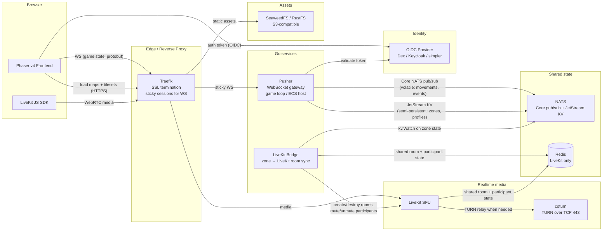

# Architecture

This document describes the overall system topology: which components exist,
how they are wired together, and where the data flows. It is derived from the
tech-stack decisions in `03-tech-stack.md` and the requirements in
`02-functional-requirements.md`.

> **Status:** draft. Several wiring decisions are **inferred** from the
> existing docs and are marked below as **[ASSUMPTION]**. They must be reviewed
> and confirmed or corrected.

## Component diagram

## Component responsibilities

### Phaser v4 Frontend (browser)
- Renders the world (tilemaps, sprites, avatars, decorations) using Phaser 4's
  GPU layers (`TilemapGPULayer`, `SpriteGPULayer`).
- Runs client-side prediction for the local avatar and snapshot interpolation
  for remote avatars (see `08-netcode.md`, to be created).
- Connects to the Pusher over a single WebSocket for all game state.
- Connects to LiveKit via the LiveKit JS SDK for audio/video.

### Traefik (reverse proxy)
- Terminates TLS (Let's Encrypt).
- Routes HTTPS asset requests to SeaweedFS/RustFS.
- Routes WebSocket game-state requests to the Pusher with **sticky sessions**
  so a reconnecting client lands on the same Go instance.
- Routes WebRTC/media traffic to LiveKit.

### Pusher (Go WebSocket gateway)
- The single game-state entry point for the client.
- Hosts the authoritative game loop / ECS (or a shard of it).
- Validates the OIDC token on the WebSocket upgrade.
- Publishes volatile events (movements, triggers) on Core NATS.
- Reads/writes semi-persistent reactive state in JetStream KV.
- Enforces zone isolation and access policies server-side.

### LiveKit Bridge (Go service)
- Watches JetStream KV for zone-state changes (`kv.Watch`).
- Translates zone policy into LiveKit actions: create/destroy rooms, mute/
  unmute participants, grant/revoke subscriptions so that people outside an
  exclusive zone cannot hear or see video from inside.
- Shares room and participant state with LiveKit through Redis.

### NATS
- **Core NATS**: ephemeral in-memory pub/sub for high-frequency volatile data
  (player movements, transient events). Subject naming convention to be
  defined in `07-network-protocol.md`.
- **JetStream KV**: semi-persistent reactive state (zone properties, global
  office variables, temporary employee profiles). See `03-tech-stack.md` for
  the rationale and example keys.

### Redis
- Central shared state **for LiveKit only**: active rooms, present
  participants. Shared between LiveKit and the Go services (notably the LiveKit
  Bridge).
- Must not be used for any other part of the application.

### LiveKit SFU + coturn
- LiveKit is the WebRTC SFU for audio/video.
- coturn provides TURN relay on TCP 443 for clients behind corporate firewalls
  that block UDP.

### SeaweedFS / RustFS (S3-compatible object storage)
- Stores and serves Tiled map JSON files and pixel-art tilesets.
- Replaces a managed S3 bucket so the whole stack stays self-hosted.

### OIDC Provider (Dex / Keycloak / simpler)
- Issues identity tokens consumed by the Pusher on the WebSocket upgrade.
- Maps an external identity to an in-world avatar/entity.

## Key data flows

### 1. Client connects and joins a world
1. Browser loads the Phaser app and the map/tilesets from SeaweedFS via
   Traefik.
2. Browser authenticates with the OIDC provider and obtains a token.
3. Browser opens a WebSocket to the Pusher (via Traefik, sticky session).
4. Pusher validates the token with the OIDC provider.
5. Pusher subscribes the client to its zone-of-interest via NATS, sends an
   initial world snapshot, and instructs the LiveKit Bridge to register the
   participant.
6. Browser connects its LiveKit JS SDK to the LiveKit SFU for spatial audio/
   video.

### 2. A user toggles a zone to exclusive (e.g. closes a door)
1. Client sends a "close door" input over the WebSocket.
2. Pusher authorises the action, updates the door entity, and writes the new
   zone state to JetStream KV (`zones.<zone_id>.properties`).
3. NATS `kv.Watch` fires:
   - The **Pusher** pushes the new zone state to all interested Phaser clients,
     which apply the visual filter (darken, halo, etc.).
   - The **LiveKit Bridge** reacts by cutting audio/video subscriptions for
     participants outside the zone.

### 3. Volatile movement (per tick)
1. Client sends input over the WebSocket.
2. Pusher runs the authoritative `MovementSystem`, publishes the new positions
   on Core NATS (volatile, not persisted).
3. Other Pushers (and the originating one) relay the relevant updates to their
   interested clients as interpolated snapshots.

## Open questions / assumptions to confirm

- **[ASSUMPTION] Client → LiveKit is direct.** The Phaser client opens a
  second connection (WebRTC via LiveKit JS SDK) to LiveKit, separate from the
  game-state WebSocket. The Pusher never proxies media. *To confirm.*
- **[ASSUMPTION] Single Pusher binary, horizontally scaled.** Multiple Pusher
  instances share state through NATS Core + JetStream KV; there is no separate
  "world simulator" service yet. *To confirm — and to decide whether world
  simulation is sharded per map or per region.*
- **[ASSUMPTION] The LiveKit Bridge is a separate Go process**, not embedded
  in the Pusher. *To confirm.*
- **[OPEN] Durable store is unspecified.** Where do user accounts, world/map
  metadata, persistent inventory, plant-growth state, leave-a-message
  contents, and audit logs live? Candidates: PostgreSQL, SQLite, or storing
  durable data in JetStream streams (not KV). To be resolved in
  `06-data-model-and-persistence.md`.
- **[OPEN] Chat backend (Matrix Synapse?)** is not wired into this diagram
  yet. If retained, it would be a separate service the client connects to
  directly, with optional bridging into zone-scoped channels.
- **[OPEN] Zone-of-interest algorithm** (grid / quadtree / distance) is not
  decided; it affects how NATS subjects are partitioned. See
  `09-zones-and-interactions.md`.
