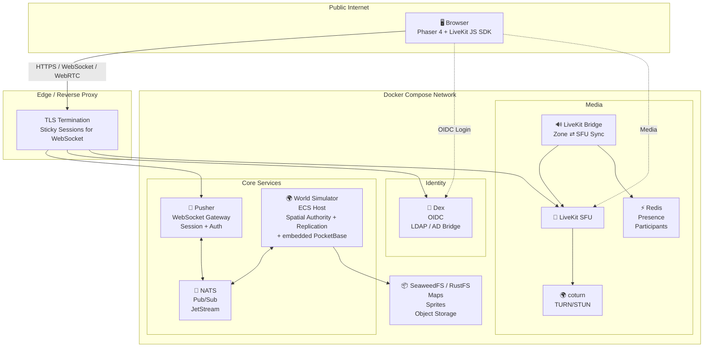
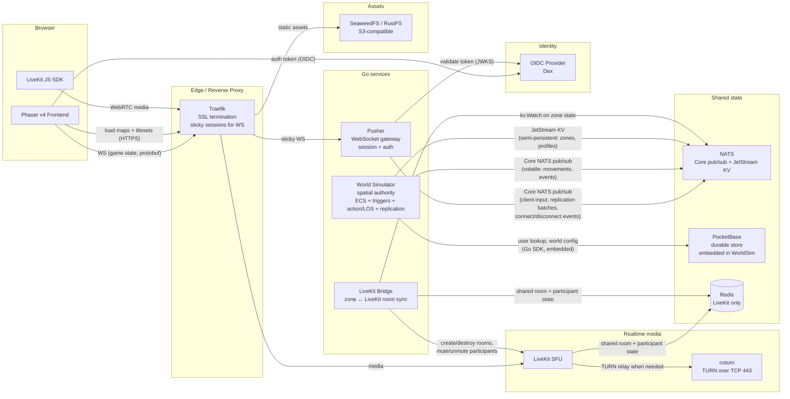

# Architecture

This document describes the overall system topology: which components exist,
how they are wired together, and where the data flows. It is derived from the
tech-stack decisions in `04-tech-stack.md` and the requirements in
`02-functional-requirements.md`.

> **Status:** draft. Several wiring decisions are **inferred** from the
> existing docs and are marked below as **[ASSUMPTION]**. They must be reviewed
> and confirmed or corrected. (PocketBase embedding in WorldSim is confirmed
> and no longer an assumption.)

## Architecture diagram

## Component diagram

## Backend services diagram

This diagram zooms into the **three Go services** — the **Pusher** (thin
network proxy), the **World Simulator** (spatial authority and replication gateway), and the
**LiveKit Bridge** (media sync) — showing their internal modules and every
communication channel between them and the surrounding state stores and
external services.

> **Key split:** the Pusher handles only WebSocket I/O, token validation, and
> NATS forwarding. The World Simulator is the **spatial authority and
> replication gateway**: it owns the ECS, the tile grid, the trigger registry,
> the zone registry, the AOI filter, and the replication encoder. Its only
> gameplay system is player avatar movement; all other gameplay behavior (NPCs,
> triggers, zone behavior, AI) is delegated to **extensions** via NATS. They
> communicate exclusively via NATS Core.

```mermaid
flowchart LR

  %% ===========================
  %% External entry points
  %% ===========================

  Browser["Browser<br/>(via Traefik)"]
  Dex["Dex<br/>OIDC"]

  %% ===========================
  %% Pusher (Go) — thin network proxy
  %% ===========================

  subgraph Pusher["Pusher (Go) — network proxy"]
    direction TB

    WS["WebSocket gateway<br/>(coder/websocket)"]
    Session["Session manager<br/>+ sticky-session state"]
    Token["Token validator<br/>(JWKS cache)"]

    WS -->|"AUTH frame"| Token
    Token -->|"validate (JWKS)"| Dex
    Token -->|"ok → entity_id"| Session
    Session <-->|"input / replication batches"| WS
  end

  %% ===========================
  %% World Simulator (Go) — authoritative sim
  %% ===========================

  subgraph WorldSim["World Simulator (Go) — spatial authority + replication gateway"]
    direction TB

    subgraph WSSim["Spatial + simulation layer"]
      ECS["ECS host<br/>(Ark)"]
      Spatial["Spatial index<br/>(tile → triggers, tile → entities)"]
      TriggerReg["Trigger registry<br/>(trigger_id → owner, behavior)"]
      ZoneReg["Zone registry<br/>(zone_id → boundaries)"]
      PlayerMove["Player movement<br/>(input → position, in-kernel)"]
      TriggerEval["Trigger evaluator<br/>(access: block/allow cached, ask routed<br/>event: notify dispatch)"]
      InputHandler["Input handler<br/>(ActionFrame → compute range/LOS/entities → broadcast)"]
    end

    subgraph WSRep["Replication layer"]
      AOI["AOI manager<br/>(area-of-interest filter)"]
      Rep["Replication encoder<br/>(component-based:<br/>Spawn / Update / Destroy / Anim)"]
    end

    subgraph WSState["State access layer"]
      KV["JetStream KV<br/>read / write"]
      PB["PocketBase<br/>Go SDK (embedded)"]
    end

    PlayerMove -->|"validate move"| TriggerEval
    TriggerEval -->|"lookup"| Spatial
    InputHandler -->|"query entities, LOS raycast"| Spatial
    Spatial --> TriggerReg
    Spatial --> ZoneReg
    ECS -->|"dirty components"| Rep
    Rep -->|"AOI filter"| AOI
    AOI -->|"per-client batches"| Rep
    ECS --> KV
    ECS --> PB
  end

  %% ===========================
  %% LiveKit Bridge (Go)
  %% ===========================

  subgraph Bridge["LiveKit Bridge (Go)"]
    direction TB

    KVWatch["KV watcher<br/>(kv.Watch on zone state)"]
    BridgeLogic["Zone → room translator"]
    LKClient["LiveKit SDK client<br/>(Server API)"]
  end

  KVWatch --> BridgeLogic
  BridgeLogic --> LKClient

  %% ===========================
  %% Shared state
  %% ===========================

  subgraph StateInfra["State & infrastructure"]
    NATSCore["NATS Core<br/>(ephemeral pub/sub)"]
    NATSKV["NATS JetStream KV<br/>(semi-persistent)"]
    PBStore["PocketBase<br/>(embedded in WorldSim)"]
    Redis[("Redis<br/>(LiveKit only)")]
  end

  %% ===========================
  %% Media
  %% ===========================

  LiveKit["LiveKit SFU<br/>(WebRTC)"]

  %% ===========================
  %% Pusher ↔ NATS (thin proxy)
  %% ===========================

  Pusher -- "publish client input,<br/>connect/disconnect events" --> NATSCore
  Pusher -- "subscribe per-client<br/>replication batches" --> NATSCore

  %% ===========================
  %% World Sim ↔ NATS + state stores
  %% ===========================

  WorldSim -- "subscribe client input,<br/>connect/disconnect,<br/>extension updates, trigger replies" --> NATSCore
  WorldSim -- "publish per-client<br/>replication batches,<br/>trigger queries, notify broadcasts" --> NATSCore
  WorldSim -- "publish volatile events<br/>(cross-shard positions)" --> NATSCore
  WorldSim -- "publish client.provisioned<br/>(for LiveKit Bridge)" --> NATSCore
  WorldSim -- "read / write player positions,<br/>read zone state (kv.Watch)" --> NATSKV
  WorldSim -- "subscribe zone changes<br/>(kv.Watch)" --> NATSKV
  WorldSim -- "lookup / create user,<br/>read world config, audit" --> PBStore

  %% ===========================
  %% Extensions (peer simulators on NATS)
  %% ===========================

  subgraph Extensions["Extensions (any language)"]
    direction TB
    ExtLogic["Entity logic<br/>Trigger logic<br/>Zone behavior<br/>NPC AI / LLM<br/>Inventory & equipment"]
  end

  Extensions -- "register, spawn, update,<br/>register_triggers (zone gate/notify, input), register_zone,<br/>trigger replies, input trigger replies, KV watch/write" --> NATSCore
  NATSCore -- "trigger queries, zone notify,<br/>input trigger dispatches, arrived, errors" --> Extensions

  %% ===========================
  %% World Sim ↔ Bridge (via NATS)
  %% ===========================

  NATSCore -. "deliver client.provisioned<br/>to Bridge" .-> KVWatch

  %% ===========================
  %% Bridge ↔ state & media
  %% ===========================

  KVWatch -- "kv.Watch<br/>zone state changes" --> NATSKV
  LKClient -- "create/destroy rooms,<br/>mute/unmute, grant/revoke" --> LiveKit
  BridgeLogic -- "read/write room +<br/>participant state" --> Redis
  LiveKit -- "shared room +<br/>participant state" --> Redis

  %% ===========================
  %% Browser entry
  %% ===========================

  Browser -- "WebSocket<br/>(protobuf, sticky)" --> WS
```

> **SVG version:** [`backend-services.svg`](backend-services.svg) — a
> high-resolution, color-coded rendering of the same diagram (suitable for
> presentations and zooming). The Mermaid version above is the canonical
> source; the SVG is generated from it.

### Communication channels at a glance

| From | To | Transport | Purpose | Frequency |
|---|---|---|---|---|
| **Pusher** | NATS Core | pub/sub | Publish client input, connect/disconnect events | Per input / per session |
| **Pusher** | NATS Core | subscribe | Receive per-client replication batches from World Sim | Per tick |
| **Pusher** | NATS Core | subscribe | Receive per-client control frames (LiveKit token, kick) | Event-driven |
| **Pusher** | Dex | HTTPS | JWKS fetch (cached 10 min), token validation | On connect / refresh |
| **Pusher** | Browser | WebSocket (protobuf) | Forward replication + control frames to client; receive client input | Per tick |
| **World Sim** | NATS Core | pub/sub | Subscribe client input + connect/disconnect + extension updates + trigger replies; publish per-client replication batches, trigger queries, notify broadcasts | Per tick |
| **World Sim** | NATS Core | pub/sub | Publish volatile cross-shard events (positions for other shards) | Per tick |
| **World Sim** | NATS Core | pub/sub | Publish `client.provisioned` (for LiveKit Bridge token issuance) | On connect |
| **World Sim** | NATS JetStream KV | KV read/write | Player positions, player status; reads zone state (written by extensions) | Per change |
| **World Sim** | PocketBase (embedded) | Go SDK (in-process) | User lookup/create, world config, audit log writes | On login / rare |
| **Extension** | NATS Core | pub/sub | Register, spawn, update entities, register triggers/zones (zone gate/notify, input), reply to trigger queries and input trigger dispatches | Per tick / event-driven |
| **Extension** | NATS JetStream KV | KV read/write | Extension-private state, shared world state (e.g. zone properties) | Event-driven |
| **Bridge** | NATS JetStream KV | `kv.Watch` | React to zone-state changes | Event-driven |
| **Bridge** | NATS Core | subscribe | Receive `client.provisioned` for token issuance | Event-driven |
| **Bridge** | LiveKit | Server API (gRPC/HTTP) | Create/destroy rooms, mute/unmute, grant/revoke subscriptions | Event-driven |
| **Bridge** | Redis | read/write | Room + participant state shared with LiveKit | Event-driven |
| **LiveKit** | Redis | read/write | Room + participant state shared with Bridge | Event-driven |

> **Key design points:**
> - The Pusher and the World Sim **never communicate directly**. All
>   communication goes through NATS Core. This keeps them decoupled — either
>   can be scaled or restarted independently.
> - The Pusher is **stateless beyond session state** (which WebSocket belongs
>   to which client). It has no ECS, no spatial index, no knowledge of entity
>   state. If a Pusher restarts, clients reconnect (sticky session) and the
>   World Sim resumes sending replication batches.
> - The World Sim is **the only service that touches PocketBase (now embedded
>   in-process via the Go SDK) and JetStream KV**. It is the authoritative
>   owner of all game state and persistent data.
> - The Pusher and the Bridge **never communicate directly** either — the
>   World Sim mediates via NATS.

## Component responsibilities

### Phaser v4 Frontend (browser)
- Renders the world (tilemaps, sprites, avatars, decorations) using Phaser 4's
  GPU layers (`TilemapGPULayer`, `SpriteGPULayer`).
- Runs client-side prediction for the local avatar and snapshot interpolation
  for remote avatars (see `12-netcode.md`).
- Connects to the Pusher over a single WebSocket for all game state.
- Connects to LiveKit via the LiveKit JS SDK for audio/video.

> **SVG diagram:** [`browser-architecture.svg`](browser-architecture.svg) —
> the full browser-side architecture with all layers (auth, asset loading,
> transports, replication decoder, netcode, local entity store, input,
> interaction, Phaser renderer, extension renderers) and their connections to
> external services.

### Traefik (reverse proxy)
- Terminates TLS (Let's Encrypt).
- Routes HTTPS asset requests to SeaweedFS/RustFS.
- Routes WebSocket game-state requests to the Pusher with **sticky sessions**
  so a reconnecting client lands on the same Go instance.
- Routes WebRTC/media traffic to LiveKit.

### Pusher (Go — WebSocket gateway / network proxy)
- The single WebSocket entry point for the client.
- Validates the OIDC token on connection (JWKS cache, see
  `08-auth-and-identity.md`).
- Manages session state (which client is on which WebSocket, sticky-session
  affinity).
- Publishes client input and connect/disconnect events to NATS Core.
- Subscribes to per-client replication batches from the World Simulator on
  NATS Core and forwards them to the client over WebSocket.
- **Does not** run the ECS, spatial index, trigger registry, AOI, replication encoding, or zone
  enforcement. **Does not** access PocketBase or JetStream KV. It is a thin
  proxy between the WebSocket and NATS.

### World Simulator (Go — spatial authority + replication gateway)
- Hosts the authoritative ECS (Ark) — see `13-ecs-design.md`.
- Owns the **spatial index** (tile grid from Tiled, tile → triggers, tile →
  entities), the **trigger registry** (trigger_id → owner, type, mode, zone),
  and the **zone registry**.
- Runs the **replication tick** (fixed interval, e.g. 20 Hz): drains input,
  processes player movement, evaluates triggers, applies extension updates,
  encodes replication batches.
- **Player avatar movement** is the only gameplay system in the kernel
  (latency-critical, deployment-invariant). All other gameplay behavior is
  delegated to extensions via NATS.
- **Evaluates zone gate triggers** (`block`/`allow` cached locally; `ask`
  routed to the owning extension via NATS), **dispatches zone notify triggers**
  (enter/exit to owning extensions), and **dispatches input triggers**
  (computes range and line-of-sight, then broadcasts to all registered
  extensions with an equipment snapshot). See `10-world-simulator.md` §5f.
- Computes the area-of-interest (AOI) per client and encodes component-based
  replication batches (`SpawnEntity`, `UpdateComponent`, `DestroyEntity`,
  `PlayAnimation` — see `11-replication.md`).
- Publishes per-client replication batches to NATS Core (the Pusher forwards
  them to clients).
- Reads/writes semi-persistent reactive state in JetStream KV (player
  positions, player status; reads zone state written by extensions).
- Reads/writes durable data in PocketBase (embedded in-process via the Go SDK;
  user lookup/create, world config, audit log).
- Publishes `client.provisioned` to NATS Core after provisioning a client
  (the LiveKit Bridge subscribes to issue a LiveKit token).
- Manages extension lifecycle (registration, heartbeat, freeze/despawn).
- Can be horizontally scaled; each instance owns a shard of the world (per
  map or per region). Cross-shard entity visibility is handled via Core NATS
  pub/sub.

### LiveKit Bridge (Go service)
- Watches JetStream KV for zone-state changes (`kv.Watch`).
- Translates zone policy into LiveKit actions: create/destroy rooms, mute/
  unmute participants, grant/revoke subscriptions so that people outside an
  exclusive zone cannot hear or see video from inside.
- Shares room and participant state with LiveKit through Redis.

### NATS
- **Core NATS**: ephemeral in-memory pub/sub for high-frequency volatile data
  (player movements, transient events). Subject naming convention to be
  defined in `07-network-protocol.md`.
- **JetStream KV**: semi-persistent reactive state (zone properties, global
  office variables, temporary employee profiles). See `04-tech-stack.md` for
  the rationale and example keys.

### Redis
- Central shared state **for LiveKit only**: active rooms, present
  participants. Shared between LiveKit and the Go services (notably the LiveKit
  Bridge).
- Must not be used for any other part of the application.

### LiveKit SFU + coturn
- LiveKit is the WebRTC SFU for audio/video.
- coturn provides TURN relay on TCP 443 for clients behind corporate firewalls
  that block UDP.

### SeaweedFS / RustFS (S3-compatible object storage)
- Stores and serves Tiled map JSON files and pixel-art tilesets.
- Replaces a managed S3 bucket so the whole stack stays self-hosted.

### OIDC Provider (Dex)
- Issues identity tokens consumed by the Pusher on the WebSocket upgrade.
- The Pusher validates the token and extracts the `sub` claim; the World
  Simulator maps `sub` → entity ID → avatar/entity via the embedded PocketBase.

## Key data flows

### 1. Client connects and joins a world
1. Browser loads the Phaser app and the map/tilesets from SeaweedFS via
   Traefik.
2. Browser authenticates with Dex and obtains an OIDC token.
3. Browser opens a WebSocket to the Pusher (via Traefik, sticky session).
4. Browser sends an `AUTH` frame with the token. The **Pusher** validates it
   (JWKS cache) and extracts the `sub` claim.
5. The **Pusher** publishes a `client.connected` event to NATS Core, including
   the `sub`, a generated `client_id`, and the Pusher instance ID.
6. The **World Simulator** receives the event:
   - Looks up or creates the user in PocketBase (by `oidc_sub`).
   - Reads or initialises the user's position from JetStream KV.
   - Registers the entity in the ECS.
   - Computes the initial world snapshot for the client's AOI.
   - Publishes the initial replication batch to NATS Core (subject
     `client.<client_id>.replication`).
7. The **Pusher** receives the replication batch and forwards it to the
   browser over WebSocket.
8. The **World Simulator** publishes `client.provisioned` to NATS Core (with
   `client_id`, `entity_id`, `zone_id`). The **LiveKit Bridge** subscribes to
   this subject, issues a LiveKit room token, and publishes it to
   `client.<client_id>.control`. The **Pusher** forwards the control frame to
   the client.
9. Browser connects its LiveKit JS SDK to the LiveKit SFU for spatial audio/
   video.

### 2. A user toggles a zone to exclusive (e.g. closes a door)
1. Client sends an `ActionFrame` (clicking the door tile, `input_type: "click:left"`) over the WebSocket.
2. **Pusher** publishes the input to NATS Core.
3. **World Simulator** receives the `ActionFrame`. Broadcasts to all
   extensions registered for `click:left`. The doors extension self-filters:
   sees the door entity in `entities_on_tile` and processes the click. The
   doors extension updates the door component (via
   `entity.<entity_id>.update`), and writes the new zone state to JetStream KV
   (`zones.<zone_id>.properties`). It may also register/unregister `block`
   triggers on the zone (via `register_triggers` /
   `unregister_triggers`).
4. The **World Sim** applies the door component update (marks it dirty for
   replication) and updates the spatial index with any trigger changes.
5. NATS `kv.Watch` fires:
   - The **World Simulator** pushes the new zone state to all interested
     clients via replication batches (NATS Core → Pusher → clients), which
     apply the visual filter (darken, halo, etc.).
   - The **LiveKit Bridge** reacts by cutting audio/video subscriptions for
     participants outside the zone.

### 3. Volatile movement (per tick)
1. Client sends input over the WebSocket.
2. **Pusher** publishes the input to NATS Core.
3. **World Simulator** receives the input, runs the **player avatar movement
   system** (in-kernel):
   - Computes the target tile from the input direction.
   - Evaluates gate triggers on the target tile (`block`/`allow` cached;
     `ask` gates query the owning extension via NATS).
   - If allowed, updates the entity's `Position` in the ECS.
   - Fires zone notify triggers for the entered/exited zones.
4. The **World Simulator**'s replication encoder picks up dirty `Position`
   components, applies the AOI filter per client, and publishes per-client
   replication batches to NATS Core.
5. **Pushers** receive the batches and forward them to their connected
   clients, which interpolate remote avatars (snapshot LERP).
6. For cross-shard visibility, the World Simulator also publishes volatile
   position updates on a shared Core NATS subject so other World Sim shards
   can relay them to their own interested clients.
7. **Extension-driven entities** (NPCs, objects) move differently: the
   extension publishes position updates via `entity.<entity_id>.update`. The
   World Sim validates each position against the trigger registry (collision,
   zone access) and applies it. The replication encoder picks up the dirty
   `Position` component on the next tick.

## Open questions / assumptions to confirm

- **[ASSUMPTION] Client → LiveKit is direct.** The Phaser client opens a
  second connection (WebRTC via LiveKit JS SDK) to LiveKit, separate from the
  game-state WebSocket. The Pusher never proxies media. *To confirm.*
- **[DECISION] Two Go services: Pusher + World Simulator.** The Pusher is a
  thin WebSocket proxy (I/O, auth validation, NATS forwarding). The World
  Simulator is the **spatial authority and replication gateway**: it owns the
  ECS, the tile grid, the trigger registry, the zone registry, the AOI
  filter, and the replication encoder. Its only gameplay system is player
  avatar movement. All other gameplay behavior is delegated to extensions.
  They communicate exclusively via NATS Core. See `09-pusher.md` for the
  Pusher specification and `10-world-simulator.md` for the World Simulator
  specification.
- **[DECISION] Pusher is horizontally scaled; World Sim is sharded.** Multiple
  Pusher instances serve WebSocket connections (Traefik sticky sessions route
  reconnecting clients to the same instance). Multiple World Sim instances
  each own a shard of the world (per map or per region); cross-shard entity
  visibility is handled via Core NATS pub/sub.
- **[ASSUMPTION] The LiveKit Bridge is a separate Go process**, not embedded
  in the World Sim. *To confirm.*
- **[DECISION] Durable store is PocketBase (embedded in WorldSim).** User
  accounts, world/map metadata, audit logs, and other durable relational data
  live in PocketBase, which is now embedded in the World Simulator as a Go
  library (not a standalone Docker service). WorldSim bootstraps the DB, runs
  Go migrations, and serves PB's HTTP API on port 8090 from a goroutine.
  Stores use the PB Go SDK DAO calls directly. See
  `06-data-model-and-persistence.md` for the full schema. (Inventory and
  equipment state is persisted by the inventory extension to JetStream KV, or
  by coordinating with the kernel for PocketBase access; see
  `18-extensions.md` §6a. Extensions do not access PocketBase directly — see
  `06-data-model-and-persistence.md` §1. Plant-growth state and
  leave-a-message contents are out of MVP scope; their storage will be defined
  when those features are added.)
- **[DECISION] Chat backend is PocketBase** (`messages` collection) for the
  MVP. Matrix Synapse is deferred to the post-MVP roadmap. See `17-chat.md`
  and `06-data-model-and-persistence.md` § 3.
- **[OPEN] Area-of-interest algorithm** (grid / quadtree / distance) is not
  decided; it affects how NATS subjects are partitioned. See
  `14-zones-and-interactions.md`.
- **[DECISION] Extension system.** External processes (any language with a
  NATS client) can register with the World Simulator as **peer simulators**
  that own all gameplay behavior for non-player entities. Extensions can
  spawn entities (no type restrictions), update any component directly
  (per-tick or event-driven), register custom component types, register
  triggers (zone gate: block/allow/ask; zone notify: enter/exit for static
  zones and proximity for mobile circle zones; input: for click/key types) on
  zones or input types,
  register zones, handle client interactions, and read/write JetStream KV.
  The World Sim's role is spatial authority (ECS, spatial index, trigger
  registry, zone registry) and replication gateway (AOI, replication
  encoding). It validates all entity changes against collision, zone access,
  and trigger rules. The only gameplay system in the kernel is player avatar
  movement. First-party extensions (walls, doors, base zone behaviors) ship
  as real sibling processes in Docker Compose. See `18-extensions.md` for the
  full specification.
