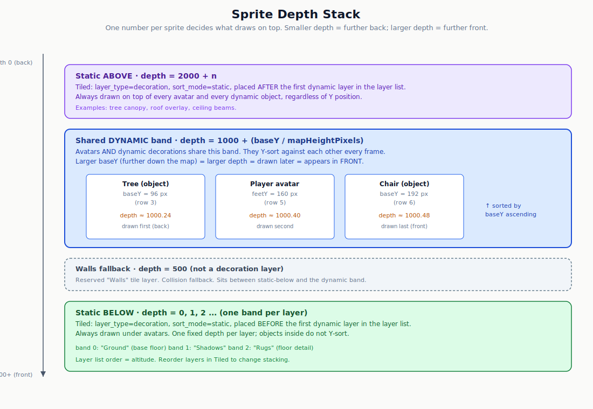
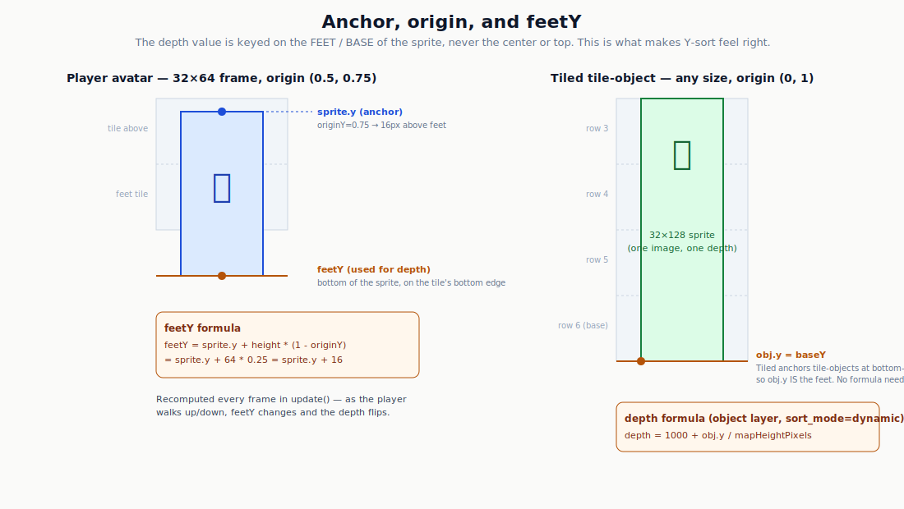
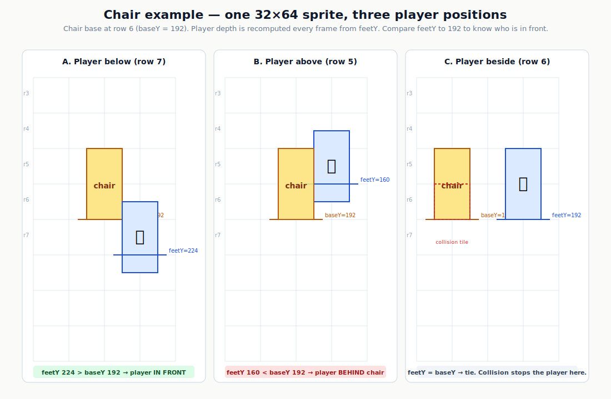
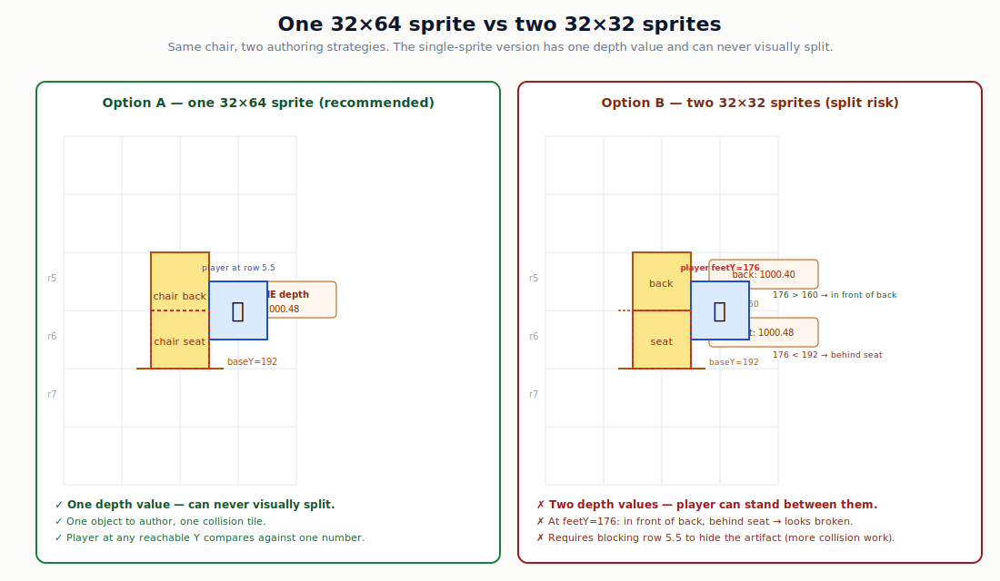
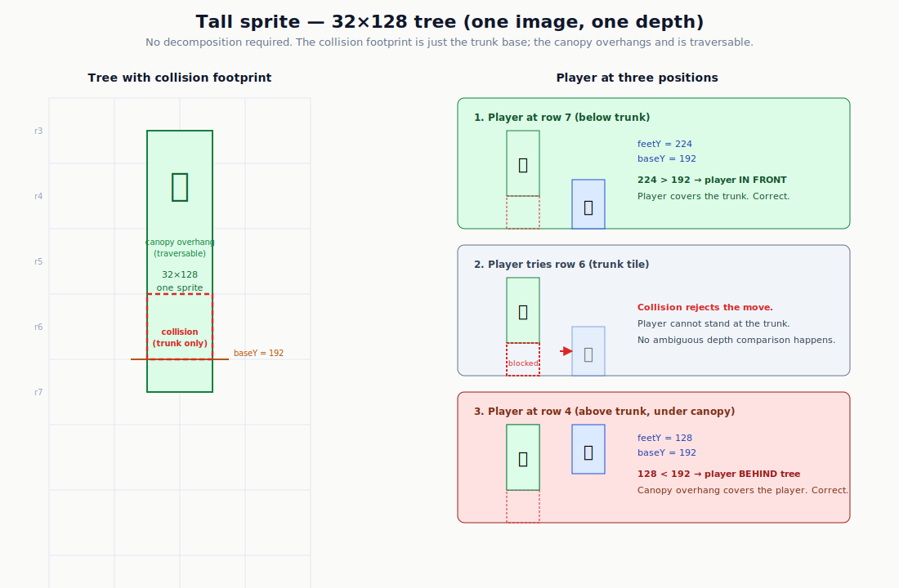
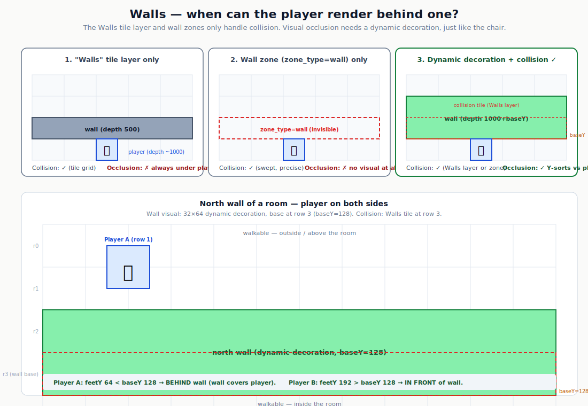

# Sprite Depth and Layering — How Front/Back Works

> **Status:** explainer. This is a focused, diagram-heavy companion to
> `21-map-design-guide.md` and
> `documentation/plans/2026-07-05-decoration-layers-and-interactive-entities-design.md`.
> If those docs answer your question, you don't need this one. Read this when
> you want the visual model of how a player ends up in front of, or behind,
> a chair / tree / wall.

This document answers three questions that keep coming up:

1. **How does the player end up in front of one part of a sprite and behind
   another part?** (e.g. a chair where the player is in front of the seat but
   behind the back.)
2. **Can a sprite be bigger than 32×32?** (e.g. a 32×128 tree — does the engine
   handle it, or do I have to chop it into 32×32 chunks?)
3. **How can the player pass "behind" a wall?** (The `Walls` tile layer always
   renders under the player — so what do you do for a north wall you can walk
   behind?)

The short answer to all three: depth is **one number per sprite**, recomputed
every frame from the sprite's **feet/base Y**. Sprites can be any size. The
"front/behind" illusion is a side effect of comparing two depth numbers, not a
property of the sprite itself. Walls are a special case covered in [§8](#8-walls--when-can-the-player-render-behind-one).

---

## 1. The mental model

Every sprite on the screen has a single floating-point number called its
**depth**. Phaser draws sprites in order of ascending depth: smaller depth =
drawn first = appears further back; larger depth = drawn last = appears in
front.

There is no per-pixel z-buffer, no layering mask, no "front half / back half"
of a sprite. Just one number per sprite. The whole system is the answer to one
question:

> **What number do we give each sprite so that the player ends up in front of
> the chair when below it, and behind the chair when above it?**

That number is derived from the sprite's **vertical position on the map** —
specifically the Y coordinate of its **feet** (for the player) or its **base**
(for a decoration). Things lower on the screen (larger Y) are drawn in front.
Things higher on the screen (smaller Y) are drawn behind. This is the standard
"Y-sort" trick used by every 2D top-down game with tall sprites.

The rest of this document is just expanding that one idea.

---

## 2. The depth band stack

All sprites in the game fall into one of four depth bands. The bands are
non-overlapping numeric ranges, so anything in a lower band is always drawn
behind anything in a higher band, regardless of Y position.



From back to front:

| Band | Depth range | What lives here | How a layer gets here |
|---|---|---|---|
| Static below | `0, 1, 2, …` | Floor tiles, rugs, shadows, ground decals | `layer_type=decoration`, `sort_mode=static`, placed **before** the first dynamic layer in the Tiled layer list |
| Walls fallback | `500` | The reserved `Walls` tile layer (collision fallback) | Named `Walls`. Not a decoration layer. |
| **Dynamic** | `1000 + baseY / mapH` | **Avatars** and **dynamic decorations** (furniture, trees, props) | `layer_type=decoration`, `sort_mode=dynamic` (object layer) |
| Static above | `2000, 2001, …` | Canopy, roof overlays, ceiling beams | `layer_type=decoration`, `sort_mode=static`, placed **after** the first dynamic layer in the Tiled layer list |

The key band is the **dynamic** one. Avatars and dynamic decorations share it,
which is what lets them Y-sort against each other. The static bands exist for
things that should *never* interleave with the player — a rug should always be
under the player, a roof should always be over the player.

### Constants in the code

`frontend/src/scenes/GameScene.ts`:

```ts
const DEPTH_BAND_DYNAMIC       = 1000;
const DEPTH_BAND_STATIC_ABOVE  = 2000;
const DEPTH_WALLS_FALLBACK     = 500;
```

Static-below layers just get `0, 1, 2, …` in the order they appear in the
Tiled layer list. Static-above layers get `2000, 2001, …` in layer-list order.
The first `sort_mode=dynamic` layer in the list flips the band assignment:
every static layer after it goes to the "above" band instead of the "below"
band.

---

## 3. The Y-sort formula

Inside the dynamic band, depth is computed from the sprite's base/feet Y:

```
depth = 1000 + (baseY_pixels / mapHeightPixels)
```

The fraction `baseY / mapHeight` is always in `[0, 1)`, so every dynamic
sprite's depth is in `[1000, 1001)`. They never collide with the static bands
(`0..N`, `500`, `2000..`). Within the dynamic band, **larger baseY = larger
depth = drawn later = appears in front**.

`baseY` means different things for different sprites:

- **Avatars:** the Y of their feet (the bottom of the sprite, after accounting
  for the origin offset — see [§4](#4-anchor-origin-and-feety)).
- **Object-layer decorations:** the Y of the object's base, which for Tiled
  tile-objects is just `obj.y` (Tiled anchors them at the bottom-left).
- **Props (server-spawned entities):** `pos.y * TILE_SIZE` (bottom-left
  convention, same as object-layer decorations).

Avatars recompute this **every frame** in `update()` — that's what makes the
player flip front/behind a decoration as it walks. Dynamic decorations from an
object layer compute it once at load time, because they don't move.

### The code

`frontend/src/scenes/GameScene.ts`:

```ts
private dynamicDepth(baseYPixels: number): number {
  const mapHeightPixels = this.mapH * TILE_SIZE || 1;
  return DEPTH_BAND_DYNAMIC + baseYPixels / mapHeightPixels;
}

private feetY(sprite: Phaser.GameObjects.Sprite): number {
  return sprite.y + sprite.height * (1 - sprite.originY);
}
```

Applied every frame for the local player and for remote avatars:

```ts
// local player
local.sprite.setDepth(this.dynamicDepth(this.feetY(local.sprite)));

// remote avatars
avatar.sprite.setDepth(this.dynamicDepth(this.feetY(avatar.sprite)));
```

And once at load time for object-layer decorations:

```ts
const sprite = this.add.sprite(obj.x, obj.y, mapped.sheet, mapped.frame);
sprite.setOrigin(0, 1);
if (sortMode === "dynamic") {
  sprite.setDepth(this.dynamicDepth(obj.y));
}
```

---

## 4. Anchor, origin, and feetY

The trick that makes Y-sort feel right is that the depth value is keyed on the
**feet** of the sprite, not its center or top. If you sorted by `sprite.y`
directly, the player would only flip in front of a chair once the *center* of
their body had passed the chair — which looks wrong, because the player's feet
are already past the chair but their head is still behind it.



### Avatars: `origin (0.5, 0.75)` on a 32×64 frame

Avatar spritesheets use 32×64 frames (`FRAME_W = 32`, `FRAME_H = 64`). The
character is roughly 48px tall, sitting inside a 64px frame so there's room
above the head. The origin is set to `(0.5, 0.75)`:

- `originX = 0.5` → horizontally centered on `sprite.x`.
- `originY = 0.75` → the anchor point is 75% of the way down the frame, i.e.
  16px above the bottom (`64 * 0.25 = 16`).

So `sprite.y` (the Phaser anchor coordinate) is placed at the tile's vertical
center, and the feet end up at the tile's bottom edge. The `feetY` helper
recovers the actual bottom-of-sprite Y from `sprite.y`:

```
feetY = sprite.y + height * (1 - originY)
      = sprite.y + 64 * 0.25
      = sprite.y + 16
```

This is the value that goes into `dynamicDepth` every frame.

### Tiled tile-objects: `origin (0, 1)`, any size

Object-layer tile-objects are simpler. Tiled anchors them at the
**bottom-left** corner, so `obj.y` in the JSON *is* the base/feet Y. The
frontend re-sets the origin to `(0, 1)` to match:

```ts
sprite.setOrigin(0, 1);
sprite.setDepth(this.dynamicDepth(obj.y));
```

No `feetY` formula needed — `obj.y` is already the base. This works for any
sprite size: 32×32, 32×64, 32×128, 64×128, etc. The anchor is always the
bottom-left, and the depth is always keyed on that one point.

---

## 5. Worked example: the chair

This is the example you asked about. A chair is visually two 32×32 tiles
stacked: a back (top) and a seat (bottom). The player should be in front of
the chair when standing below it, and behind the chair when standing above it.



The chair is authored as **one 32×64 tile-object** on an object layer with
`layer_type=decoration` and `sort_mode=dynamic`. Its base is at row 6, so
`baseY = 6 * 32 = 192`. Its depth is `1000 + 192 / mapH`.

Three player positions:

| Player stands at | Player feetY | vs chair baseY=192 | Result |
|---|---|---|---|
| Row 7 (below chair) | 224 | `224 > 192` | Player **in front** of chair |
| Row 6 (beside chair) | 192 | `192 = 192` | Tie. Collision stops the player here. |
| Row 5 (above chair) | 160 | `160 < 192` | Player **behind** chair |

That is the entire mechanism. The player's depth is recomputed every frame
from its feetY; the chair's depth is fixed at load. Phaser draws the smaller
depth first, so whoever has the smaller baseY is drawn behind.

### Why the "front of seat, behind back" intuition works

Notice that we never told the engine anything about the chair's back vs its
seat. The chair is one sprite with one depth value. The reason the player
appears in front of the *seat* when below the chair is that the player's
feetY is greater than the chair's *base* (which is at the seat). The reason
the player appears behind the *back* when above the chair is that the
player's feetY is less than the chair's base — so the whole chair (back
included) is drawn on top of the player.

The single depth value works because the chair's base is at the *bottom* of
the sprite, which is the part the player's feet actually compare against
when walking past. The back is just visual overhang above the base, exactly
like the canopy of a tree (see [§7](#7-tall-sprites-the-32x128-tree)).

### Collision footprint

Mark only the chair's base tile (row 6, the seat) as non-traversable in the
`Walls` layer. Do **not** mark row 5 (the back) as blocked — the back is
visual overhang, not a physical obstacle. This keeps the player out of the
seat, which is the only position where the single-depth model would look
wrong (the player would be standing "inside" the chair).

---

## 6. One 32×64 sprite vs two 32×32 sprites

You could also author the chair as two separate 32×32 tile-objects on the
same dynamic object layer: one for the back (baseY=160), one for the seat
(baseY=192). Each gets its own depth value. This works, but it has a
failure mode the single-sprite version does not.



### The split problem

If the player stands at row 5.5 (feetY=176), their depth is between the back's
depth and the seat's depth:

- `176 > 160` → player drawn **in front of** the back.
- `176 < 192` → player drawn **behind** the seat.

Visually, the player's body is in front of the chair's back but behind the
chair's seat. That looks broken — the seat is supposed to be the *lower* part
of the same chair, not a separate object in front of the player.

The single 32×64 sprite can never split this way, because it has only one
depth value. There is no "between the back and the seat" comparison to fail.

### When you might still choose two sprites

- Your tileset only has 32×32 tiles and you can't add a 32×64 tile.
- You want the back and seat to be independently animated or interactable
  (rare for a chair).

If you do go with two sprites, **block row 5.5 with collision** so the player
can never reach the split position. With the seat tile (row 6) marked
non-traversable, the only reachable positions are "below" (front) or "above"
(behind), and both look correct. This is more collision work for the same
visual result, which is why the single-sprite version is recommended.

---

## 7. Tall sprites: the 32×128 tree

**Yes, sprites can be bigger than 32×32.** A 32×128 tree is supported and is
explicitly designed for. It is **not** decomposed into 32×32 chunks. It is
one image with one depth value.



Author the tree as one object-layer tile-object, 32 wide and 128 tall, on a
`layer_type=decoration, sort_mode=dynamic` object layer. Tiled anchors it at
the bottom-left, so `obj.y` is the trunk's base. The depth is
`1000 + obj.y / mapH`.

The tree visually spans four tiles (rows 3-6 in the diagram), but its depth
is anchored at row 6 (the trunk base). The canopy overhangs rows 3-5
visually, but those rows are not collidable.

### Player positions

| Player at | feetY | vs tree baseY=192 | Result |
|---|---|---|---|
| Row 7 (below trunk) | 224 | `224 > 192` | Player in front of whole tree |
| Row 6 (trunk tile) | — | — | **Blocked by collision.** Player can't stand here. |
| Row 5 (under canopy) | 160 | `160 < 192` | Player behind whole tree (canopy covers player) |
| Row 4 (under canopy) | 128 | `128 < 192` | Player behind whole tree |

The single depth value is correct at every reachable position, because the
collision footprint keeps the player out of the only position where it would
be wrong (standing at the trunk's base, inside the canopy's vertical extent).

### The collision footprint rule

This is the one rule you must follow for tall sprites, straight from the
design doc:

> The object's collision footprint should be authored narrower than its
> visual sprite (e.g. `Traversable=false` only on the trunk's base tile,
> not the full 3.5-tile bounding box). This keeps the player out of positions
> where a single flat depth value would look visually wrong for that
> sprite's silhouette.

For the 32×128 tree: mark **only the trunk's base tile** (row 6) as
non-traversable in the `Walls` layer. The canopy tiles (rows 3-5) are
traversable — the player can walk freely under them, and will correctly
appear behind the canopy because their feetY is above the trunk's base.

### When the single-sprite model breaks

If a specific asset's silhouette makes single-image occlusion look wrong at
some reachable player position — the design doc's example is a very wide, low
canopy — the fallback is to **split the sprite into two objects**:

1. A Y-sorted trunk on a `sort_mode=dynamic` layer (the part the player can
   walk around).
2. An always-in-front canopy on a `sort_mode=static` layer placed *after* the
   dynamic layer in the layer list, so it lands in the `DEPTH_BAND_STATIC_ABOVE`
   band (`2000+n`) and renders over everyone.

This is a per-asset authoring choice, not an engine limitation. Most tall
sprites (trees, pillars, walls-as-props) do not need it.

---

## 8. Walls — when can the player render behind one?

Walls are a different case from the chair/tree, and the answer is not
obvious. There are **two** existing wall systems in the codebase, and
**neither one gives you visual "walk behind" occlusion by default.**

### The two existing wall systems

**1. The `Walls` tile layer — collision fallback, always renders BELOW the player.**

The reserved `Walls` tile layer (matched by name, case-insensitive) does two
things:

- **Collision grid:** any non-zero tile = blocked. `GameScene` reads it into
  `collisionGrid` and worldsim does the same server-side.
- **Rendering:** the whole layer is drawn at a fixed `DEPTH_WALLS_FALLBACK =
  500` (<ref_snippet file="/Users/lstep/Workspace/GIT/PixelEruv.o/frontend/src/scenes/GameScene.ts" lines="699-700" />).

The problem: `500` is below the dynamic band (`1000`). The player's depth is
always `~1000 + something`. So **every wall tile in the `Walls` layer is
always drawn under the player.** The wall only stops movement; it never
hides the player.

**2. Wall zones (`zone_type=wall`) — pure collision, not rendered at all.**

Rectangles/polygons on the `Zones` object layer, handled by `ext-walls`.
Swept segment-vs-shape collision (more precise than the tile grid). They have
**no visual** — they're invisible collision volumes. They also can't hide
the player.

### Why walls are different from the chair

The chair works because it's on a `sort_mode=dynamic` object layer, which
puts it in the same depth band as the player (`1000 + baseY/mapH`), so they
Y-sort against each other. The `Walls` tile layer is explicitly **not** a
decoration layer — it's at a fixed low depth (`500`) so it always renders
under everything in the dynamic band. That's by design: most walls are
floor-level obstacles (like the boundary of the map), and you don't want the
player to disappear behind them.

But a **tall wall** — a north wall you can walk behind, a fence, a room
divider, a building facade — needs the chair treatment, not the `Walls`-layer
treatment.

### How to actually get "walk behind a wall"

Author the wall as a **dynamic decoration** (the chair/tree pattern), and
handle collision separately. Two layers, one wall:

- **Collision (pick one):**
  - **Option A:** put collision tiles in the `Walls` tile layer at the wall's
    base row. This blocks movement. The `Walls` layer renders at depth 500
    (under the player), but you won't see those tiles because your visual
    wall (below) draws over them at a higher depth.
  - **Option B:** draw a `zone_type=wall` rectangle on the `Zones` layer at
    the wall's base. `ext-walls` blocks movement there. No visual.
- **Visual (the occluding part):** author the wall as tile-objects on an
  object layer with `layer_type=decoration, sort_mode=dynamic`. Each wall
  segment is a sprite (e.g. 32×64 for a 1-tile-tall wall, 32×96 for a
  1.5-tile wall, etc.) anchored at its base, just like the chair. It gets
  `depth = 1000 + baseY/mapH` and Y-sorts against the player.

### The north-wall-of-a-room example

This is the case you're probably thinking of. A room with a north wall at
row 3. Walkable space inside the room (rows 4+) and walkable space outside
above the wall (rows 0-2, e.g. a hallway or outdoor area north of the
building).



- Wall visual: a 32×64 (or taller) tile-object on a `sort_mode=dynamic`
  object layer, base at row 3 (`baseY = 128`).
- Wall collision: a tile in the `Walls` layer at row 3 (blocks the player
  from walking through the wall).
- Player above the wall (rows 0-2): `feetY < 128` → depth < wall's depth →
  player drawn **behind** the wall. The wall hides them.
- Player below the wall (row 4+): `feetY > 128` → depth > wall's depth →
  player drawn **in front of** the wall.

This is exactly the chair pattern, just at wall scale. The only difference
from the chair is that the wall also has a collision tile in the `Walls`
layer (or a wall zone) so the player can't walk *through* it — they can only
walk *behind* it (from above) or *in front of* it (from below).

### The case where "walk behind" doesn't apply

If the wall is at the **edge of the map** (no walkable space on the other
side), there's no "behind" to worry about — the player can never get there.
In that case, just use the `Walls` tile layer as-is. The wall renders under
the player (depth 500), collision stops the player, and nobody cares about
occlusion because the player can never be on the far side. This is why the
`Walls` layer is at a fixed low depth by default: it's optimized for the
common case (boundary walls) where occlusion doesn't matter.

### Summary

| Wall type | Collision | Visual occlusion | When to use |
|---|---|---|---|
| `Walls` tile layer only | yes (tile grid) | **no** — always renders under player (depth 500) | Boundary walls, map edge, anywhere the player can't get behind |
| Wall zone (`zone_type=wall`) only | yes (swept, precise) | **no** — invisible | Same, when you need thinner-than-tile or polygon shapes |
| Dynamic decoration + `Walls`/zone collision | yes (from Walls/zone) | **yes** — Y-sorts against player | Tall walls, north walls, fences, room dividers, building facades — anywhere the player can be on both sides |

The rule: **if the player can be on both sides of the wall, the wall's
visual must be a `sort_mode=dynamic` decoration, not a `Walls`-layer tile.**
The `Walls` layer (or a wall zone) still handles collision; the dynamic
decoration handles occlusion.

---

## 9. There is no per-pixel occlusion

The engine does **not** slice sprites per-row or per-pixel for occlusion. A
tall sprite is one flat image with one depth value. This is a deliberate
tradeoff:

- **Pro:** simple, fast, no per-frame sorting cost beyond comparing one
  number per sprite. Works for the vast majority of furniture and scenery.
- **Con:** if the player can reach a position where the single depth value
  gives a visibly wrong result for that sprite's silhouette, the fix is
  authoring (collision footprint, or splitting into two objects) — not engine
  work.

This is the same tradeoff every classic 2D top-down game makes (Zelda, Pokemon,
Stardew Valley, etc.). Per-pixel depth buffers are a 3D-engine technique and
are not worth the cost here.

---

## 10. What is not supported today

1. **Per-tile Y-sort on tile layers.** If you set `sort_mode=dynamic` on a
   *tile* layer (not an object layer), the whole layer gets a flat
   `DEPTH_BAND_DYNAMIC` depth and the frontend prints a console warning:

   > `decoration layer "<name>": sort_mode=dynamic on a tile layer only gets
   > a flat depth (per-tile Y-sort isn't implemented yet)`

   Per-object Y-sort only works for **object layers** (individually placed
   props). If you want a tile-layer tree to Y-sort against the player, place
   it as an object on an object layer instead.

2. **Per-pixel / per-row occlusion.** Deliberately not done. See [§9](#9-there-is-no-per-pixel-occlusion).

3. **Moving dynamic decorations.** Dynamic decorations from an object layer
   compute their depth once at load. If you need a *moving* object that
   Y-sorts against the player, it has to be a server-spawned entity (a
   "prop"), which recomputes depth each frame like an avatar does.

---

## 11. Authoring checklist

For a sprite that must let the player walk in front of it and behind it:

1. **Author it as a tile-object on an object layer** — not as cells in a
   tile layer. (Per-tile Y-sort on tile layers is not implemented.)
2. **Set the layer's custom property** `layer_type = decoration`.
3. **Set the layer's custom property** `sort_mode = dynamic`.
4. **The tile can be any size** in the tileset: 32×32, 32×64, 32×128, etc.
   Tiled anchors the object at its bottom-left, which is what the depth
   formula expects. You do not need to decompose tall sprites into 32×32
   chunks. The frontend loader reads each tileset's `tilewidth`/`tileheight`
   from the Tiled JSON and slices the spritesheet accordingly, falling back
   to the map's tile size (32×32) when the tileset doesn't override it. See
   [§12](#12-tileset-size-requirements) for the two supported tileset
   workflows and what does *not* work.
5. **Mark only the collidable footprint** (e.g. the chair seat, the tree
   trunk base) as non-traversable in the `Walls` layer — not the full visual
   bounding box. The visual overhang should be traversable.
6. **Place any always-on-top overlay** (canopy, roof) on a separate
   `sort_mode=static` layer *after* the dynamic layer in the Tiled layer
   list, so it lands in the `DEPTH_BAND_STATIC_ABOVE` band and renders over
   everyone.

That is the entire authoring contract. There is no sprite-size limit and no
decomposition requirement. The only hard rule is: **use an object layer with
`sort_mode=dynamic` if you want per-object Y-sort against the player.**

---

## 12. Tileset size requirements

The frontend loader (`GameScene.preload`) reads each tileset's `tilewidth` and
`tileheight` from the Tiled JSON and slices the spritesheet at that size,
falling back to the map's tile size (32×32) when the tileset doesn't override
it. This lets you ship non-32×32 tilesets for tall sprites.

### Supported: one sheet-based tileset per tile size

For each non-standard tile size, create a dedicated sheet-based tileset PNG
with `tilewidth`/`tileheight` set to that size:

- `furniture_32x64.png` — 32 wide × 64 tall per cell. Holds a chair, stool,
  small bookshelf, potted plant, lamp — **as many 32×64 tiles as you want**,
  arranged in a grid in the PNG. Every tile in this tileset must be 32×64.
- `trees_32x128.png` — 32 wide × 128 tall per cell. Holds as many 32×128
  trees as you want.
- Your existing 32×32 tilesets stay as they are.

You can have as many tilesets as you want in one map, one per tile size. When
you drag a tile from one of these tilesets onto an object layer, Tiled writes
the object's `width`/`height` automatically from the tileset's tile size —
you don't set those fields manually.

### Not supported: "Collection of Images" tilesets

Tiled's "Collection of Images" tileset type lets you mix tiles of different
sizes in one tileset, each pointing to its own image file. **This does not
work in the current codebase.** Two places break:

1. `frontend/src/mapLoader.ts` reads `ts.image` per tileset and expects one
   PNG per tileset. Collection-of-images tilesets have no top-level `image`;
   each tile has its own.
2. `frontend/src/scenes/GameScene.ts` loads each tileset as one spritesheet
   via Phaser's `load.spritesheet`, which takes a single PNG. It cannot load
   per-tile images.

If you need mixed sizes in one tileset, that requires a non-trivial change to
both `mapLoader.ts` (enumerate per-tile images, upload them all to
PocketBase) and `GameScene.preload` (load each tile image as its own texture,
not a spritesheet). Until that lands, use one sheet-based tileset per tile
size as described above.

---

## 13. Where to look in the code

All of the logic lives in `frontend/src/scenes/GameScene.ts`:

| What | Where |
|---|---|
| Depth band constants | lines 33-38 |
| `dynamicDepth(baseY)` | lines 520-526 |
| `feetY(sprite)` | lines 528-535 |
| `isDecorationLayer(layer)` | lines 229-232 |
| Decoration layer iteration + band assignment | lines 700-750 |
| Avatar sprite creation (origin 0.5, 0.75) | lines 1759-1765 |
| Per-frame depth update for local player | line 1265 |
| Per-frame depth update for remote avatars | line 1322 |
| Per-frame depth update for props | line 1840 |
| Per-tileset spritesheet loading (respects `tilewidth`/`tileheight`) | `preload()`, ~lines 622-645 |
| `Walls` layer collision grid + `DEPTH_WALLS_FALLBACK` render | ~lines 696-710 |

The design doc is
`documentation/plans/2026-07-05-decoration-layers-and-interactive-entities-design.md`
(Part B is the depth algorithm; "Anchoring multi-tile-tall objects" and
"Occlusion for large sprites" cover the tall-sprite case).

The existing map design guide is `21-map-design-guide.md` — see its
"Decoration layers" and `sort_mode` sections for the authoring-side reference.

The existing overview diagram is `depth-layers-diagram.svg` — an exploded
side view of the same band stack shown in [§2](#2-the-depth-band-stack).
