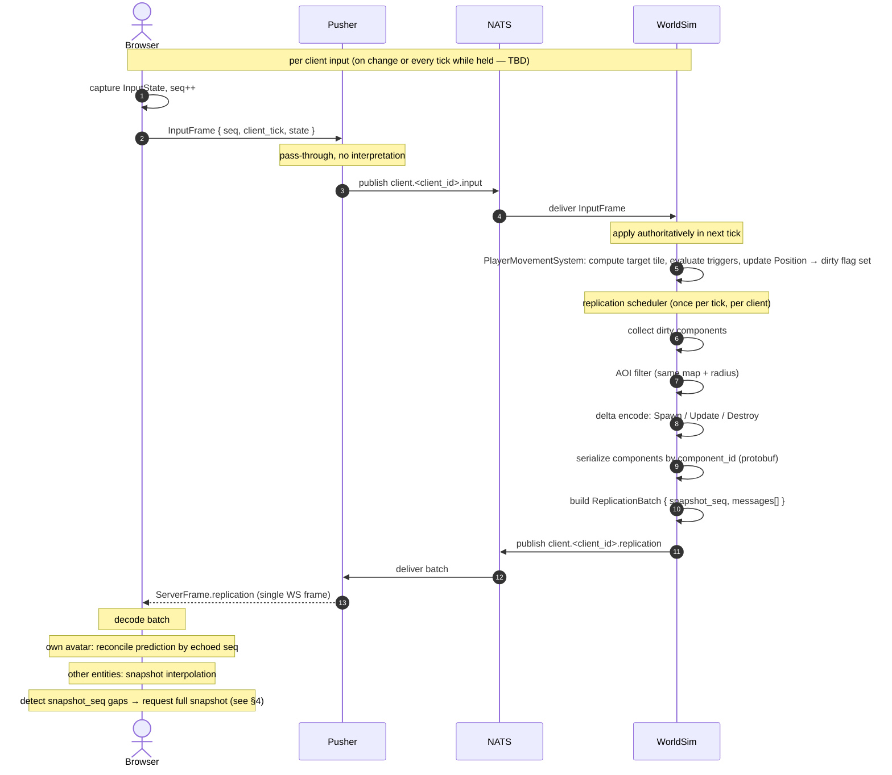
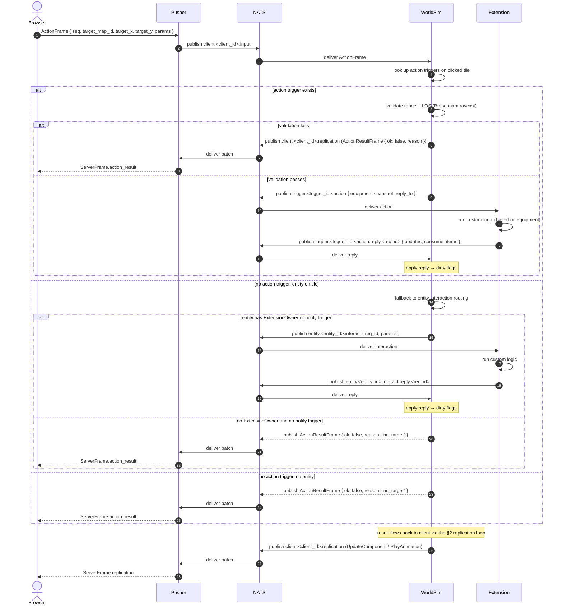
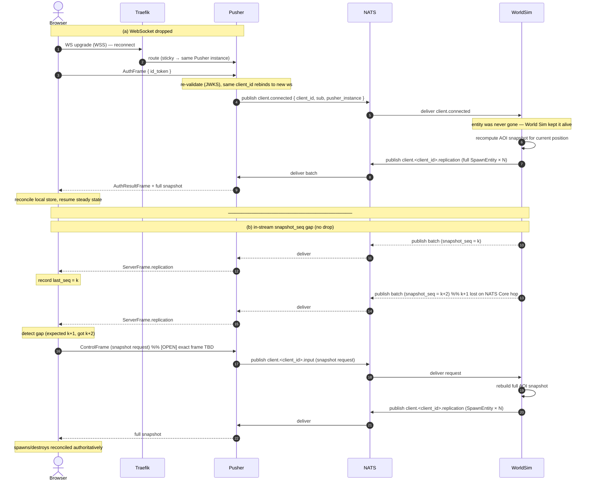
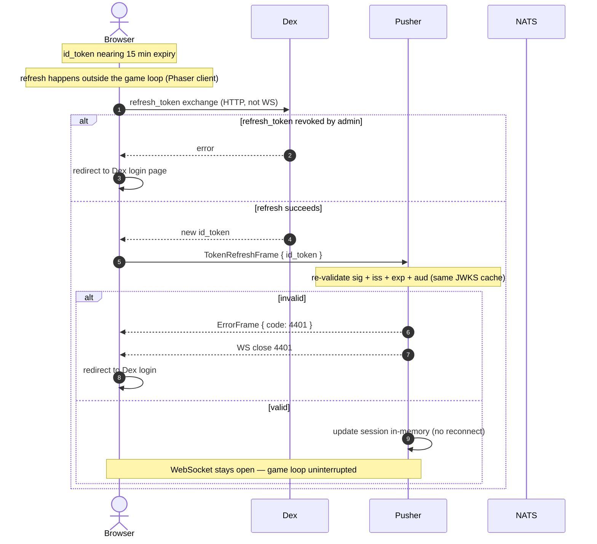
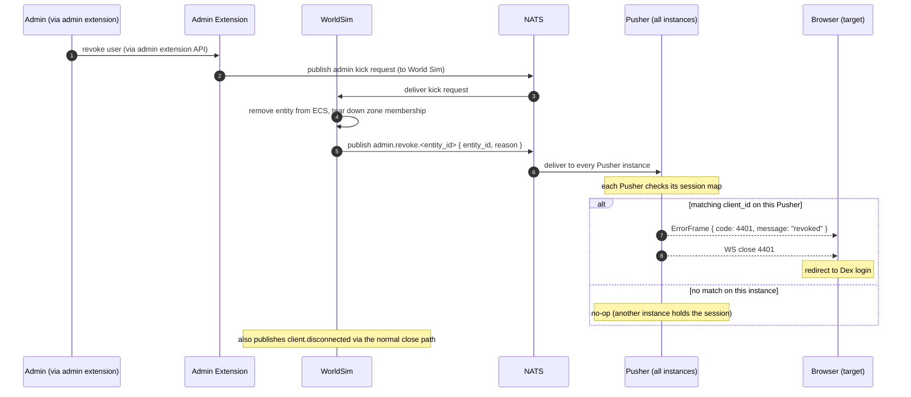

# Networking Sequences

End-to-end sequence diagrams for the client-facing networking flows.
Companion to `networking-flow.svg` (station view) and the prose in
`07-network-protocol.md`, `08-auth-and-identity.md`, `09-pusher.md`,
`11-replication.md`.

> Actors are services, not goroutines. `NATS` is the Core bus;
> `KV` is JetStream KV (same process, drawn separately for clarity).
> All client ↔ Pusher frames are binary protobuf `ClientFrame` / `ServerFrame`
> over a single WSS connection.

---

## 1. Connection handshake

From WebSocket open to steady state. Covers the 5 s auth timeout, the
`4401` failure branch, and the asynchronous entity provisioning + initial
snapshot.


---

## 2. Steady-state input + replication loop

The hot loop, repeated every client input and every World Sim tick (20 Hz).
Shows why the echoed `seq` enables client-side prediction reconciliation.



---

## 3. Interaction with extension routing

An `ActionFrame` targets a tile the player clicks (or the facing tile for
keypress interactions — `InteractFrame` has been deprecated and replaced by
`ActionFrame`). The World Simulator validates range and line-of-sight (if
action triggers require them), then routes: action triggers on the clicked
tile take priority; if none exist, the kernel falls back to entity interaction
routing based on the `ExtensionOwner` component or entity-bound `notify`
triggers. The kernel has no TriggerSystem — all interaction behavior is in
extensions.



---

## 4. Reconnect and snapshot recovery

Two recovery paths: (a) WebSocket drop with sticky-session reconnect to the
same Pusher, and (b) in-stream `snapshot_seq` gap detection without a drop.



---

## 5. Token refresh

Background refresh that must not drop the WebSocket. The `id_token` lifetime
is 15 minutes; the client obtains a fresh one via Dex's `refresh_token` and
sends it in-band.



---

## 6. Admin kick / revocation

Instant eviction without waiting for the 15-minute `id_token` expiry. The
revocation **policy** (who can kick, under what conditions) is in an admin
extension. The revocation **execution** is in the World Sim: it publishes
`admin.revoke.<entity_id>`; every Pusher instance subscribes and closes the
matching WebSocket.



---

## Coverage and gaps

These six cover the complete client-facing networking story: connect,
steady state, interact, recover, refresh, revoke.

Not yet diagrammed (available on request):

- **Extension lifecycle** — `extension.register` → `registered` →
  `register_components` → `register_triggers` → `register_zone` → `spawn` →
  `batch_update` → `interact` routing → `despawn` → `deregister` + heartbeat.
  Different actor set (Extension ↔ WorldSim, no client).
- **LiveKit media token issuance** — `client.provisioned` → Bridge signs
  room JWT → `client.<client_id>.control` → `ControlFrame.livekit_token` →
  client joins SFU. Media plane handoff.
- **Cross-shard entity transfer** — `world.<shard_id>.volatile` between
  World Sim shards. Niche; defer unless sharding is being designed actively.
```
