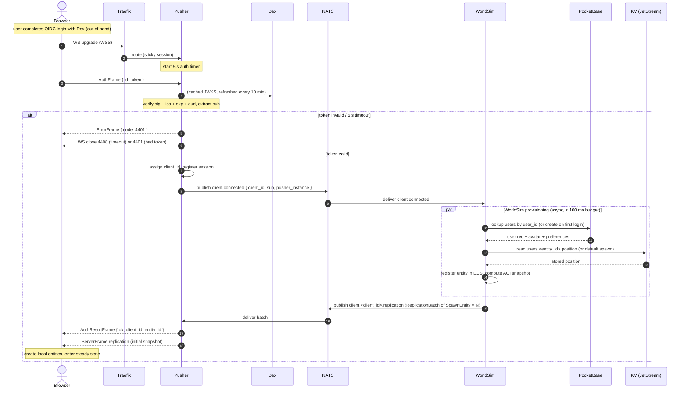
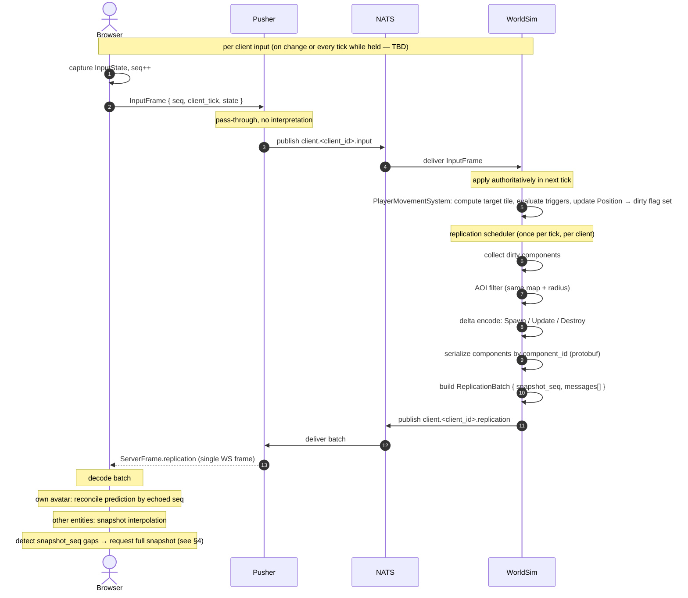
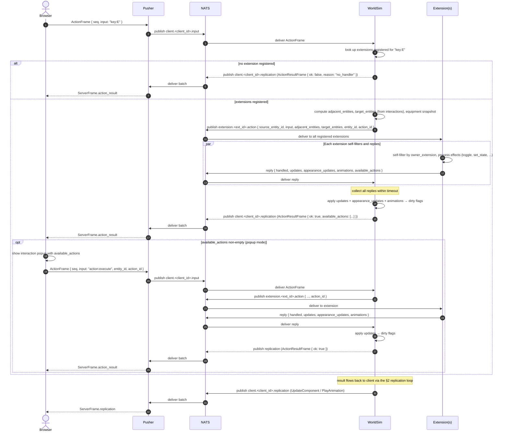
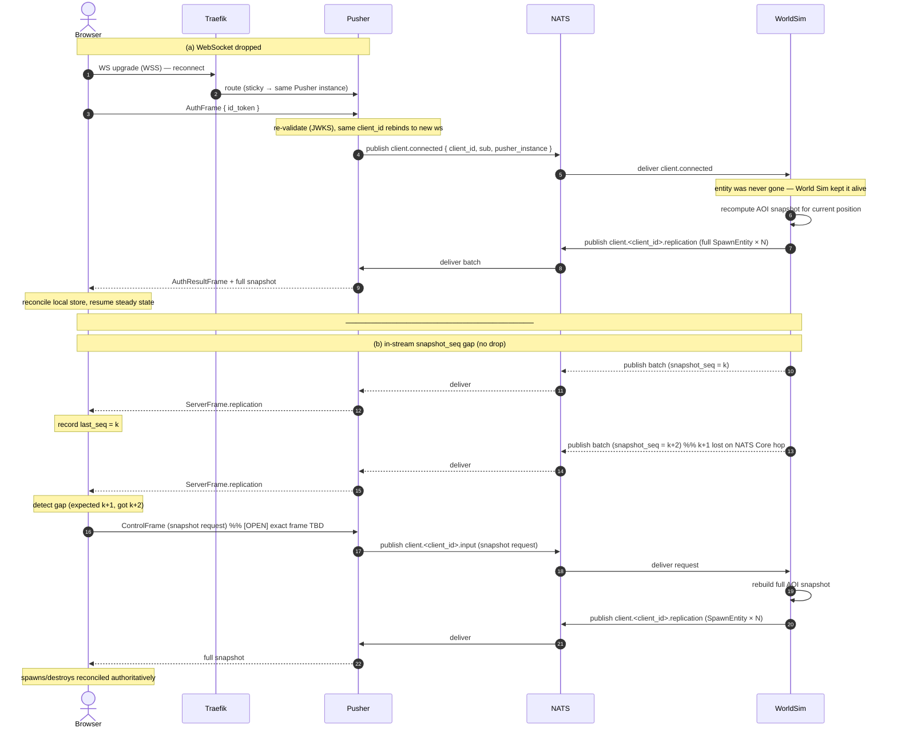
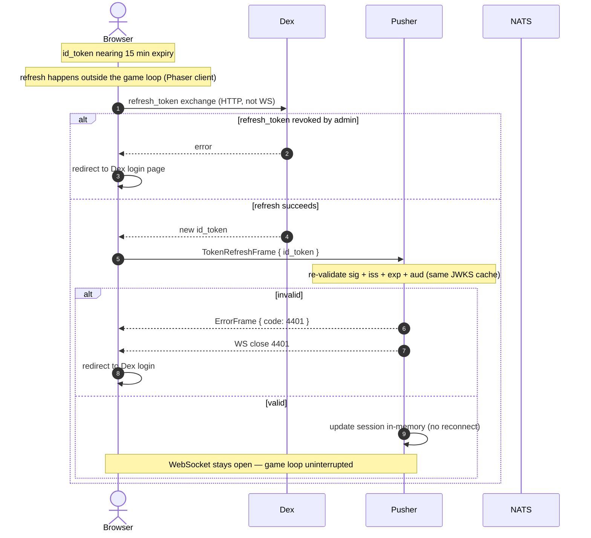
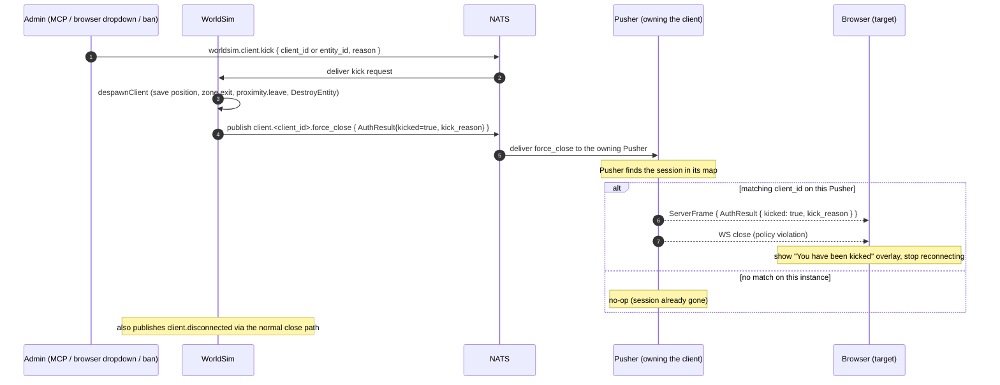
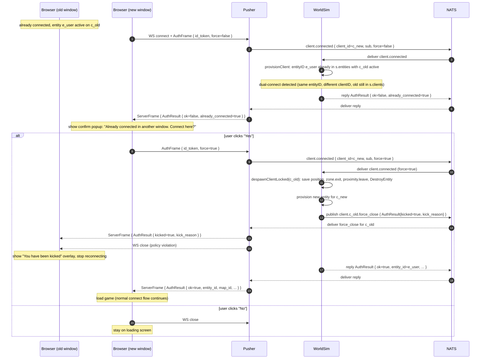

# Networking Sequences

End-to-end sequence diagrams for the client-facing networking flows.
Companion to `networking-flow.svg` (station view) and the prose in
`07-network-protocol.md`, `08-auth-and-identity.md`, `09-pusher.md`,
`11-replication.md`.

> Actors are services, not goroutines. `NATS` is the Core bus;
> `KV` is JetStream KV (same process, drawn separately for clarity).
> All client ↔ Pusher frames are binary protobuf `ClientFrame` / `ServerFrame`
> over a single WSS connection.

---

## 1. Connection handshake

From WebSocket open to steady state. Covers the 5 s auth timeout, the
`4401` failure branch, and the asynchronous entity provisioning + initial
snapshot.



---

## 2. Steady-state input + replication loop

The hot loop, repeated every client input and every World Sim tick (20 Hz).
Shows why the echoed `seq` enables client-side prediction reconciliation.



---

## 3. Interaction with input trigger broadcast

An `ActionFrame` carries an `input` (e.g. `click:left`, `key:E`,
`action:execute`) and optional `entity_id`/`action_id` (for popup-mode
choices). The World Simulator computes contextual data (range, LOS, entities
on tile / adjacent entities, target entities from `interactions` target_ids,
equipment snapshot) and broadcasts to all extensions that registered for that
input type. Each extension self-filters and replies asynchronously. All
replies within the timeout are applied. The kernel has no TriggerSystem — all
interaction behavior is in extensions.

For the two-phase interaction flow (see
`documentation/plans/2026-07-15-interaction-system-design.md`), the first
`key:E` press may return `available_actions` (popup mode) without executing
effects. The user picks an action, and the client sends a second
`ActionFrame` with `input: "action:execute"`, `entity_id`, and `action_id`.



---

## 4. Reconnect and snapshot recovery

Two recovery paths: (a) WebSocket drop with sticky-session reconnect to the
same Pusher, and (b) in-stream `snapshot_seq` gap detection without a drop.



---

## 5. Token refresh

Background refresh that must not drop the WebSocket. The `id_token` lifetime
is 15 minutes; the client obtains a fresh one via Dex's `refresh_token` and
sends it in-band.



---

## 6. Admin kick / revocation

Instant eviction without waiting for the 15-minute `id_token` expiry. The
revocation **policy** (who can kick, under what conditions) is in an admin
extension. The revocation **execution** is in the World Sim: it despawns
the entity and publishes `client.<client_id>.force_close` with a marshaled
`ServerFrame` (`AuthResult{kicked=true, kick_reason}`); the Pusher instance
owning that client forwards the frame to the WebSocket, then closes it so
the browser shows the "kicked" overlay and stops reconnecting.

Kick can be triggered three ways: MCP server (`worldsim.client.kick` by
client_id or entity_id), admin browser dropdown (KickFrame → pusher →
`worldsim.client.kick`), or ban (`worldsim.client.ban` — despawn +
force_close the matching client).



---

## 7. Dual-connect confirmation

When a logged-in user opens a second browser window, both windows mint the
same persistent `entity_id` (from PocketBase). Without detection, the
second `provisionClient` silently overwrites the first entity, and the old
window becomes a frozen zombie (drops input, receives no replication,
oscillates position saves). The dual-connect flow detects this and asks
the user to confirm before displacing the old session.



The reconnect race (old session already gone from `s.clients` before the
new `provisionClient` runs) is NOT a dual-connect: `provisionClient`
treats it as a normal reconnect and reuses the stale entity via the
`removeStaleMobileZone` path. See `worldsim_reconnect_race_test.go` and
`worldsim_dualconnect_test.go`.

---

## Coverage and gaps

These seven cover the complete client-facing networking story: connect,
steady state, interact, recover, refresh, revoke, dual-connect.

Not yet diagrammed (available on request):

- **Extension lifecycle** — `extension.register` → `registered` →
  `register_components` → `register_triggers` → `register_zone` → `spawn` →
  `batch_update` → `interact` routing → `despawn` → `deregister` + heartbeat.
  Different actor set (Extension ↔ WorldSim, no client).
- **LiveKit media token issuance** — `client.provisioned` → Bridge signs
  room JWT → `client.<client_id>.control` → `ControlFrame.livekit_token` →
  client joins SFU. Media plane handoff.
- **Cross-shard entity transfer** — `world.<shard_id>.volatile` between
  World Sim shards. Niche; defer unless sharding is being designed actively.
```
