# OpenTelemetry Setup Guide (with motel)

This document explains, step by step, how to wire OpenTelemetry into a Go
backend (and an optional TypeScript/Vite frontend) so that traces and logs
flow into [motel](https://github.com/kitlangton/motel), a local OTLP/HTTP
collector with a query API and TUI. It is written to be reusable: follow it
for any new Go project that needs runtime-evidence debugging.

The patterns below were extracted from the PixelEruv codebase, where two Go
services (`pusher` and `worldsim`) communicate over NATS, and a Phaser
frontend talks to the pusher over WebSocket. The same approach works for any
service-to-service Go project — only the transport-specific propagation
helpers change.

---

## Table of contents

1. [What you get](#1-what-you-get)
2. [Prerequisites](#2-prerequisites)
3. [Go dependencies](#3-go-dependencies)
4. [The `otel` package](#4-the-otel-package)
   - 4.1 [Init: TracerProvider + LoggerProvider](#41-init-tracerprovider--loggerprovider)
   - 4.2 [Env-var configuration](#42-env-var-configuration)
   - 4.3 [Endpoint parsing](#43-endpoint-parsing)
5. [Wiring `Init` into `main`](#5-wiring-init-into-main)
6. [Creating spans and correlated logs](#6-creating-spans-and-correlated-logs)
7. [Context propagation across a message bus (NATS)](#7-context-propagation-across-a-message-bus-nats)
   - 7.1 [The header carrier adapter](#71-the-header-carrier-adapter)
   - 7.2 [Inject before publish](#72-inject-before-publish)
   - 7.3 [Extract on subscribe](#73-extract-on-subscribe)
8. [Browser → backend trace connection (traceparent in protobuf)](#8-browser--backend-trace-connection-traceparent-in-protobuf)
   - 8.1 [Add a `traceparent` field to your proto messages](#81-add-a-traceparent-field-to-your-proto-messages)
   - 8.2 [Backend: parse traceparent into a context](#82-backend-parse-traceparent-into-a-context)
   - 8.3 [Frontend: serialize the active span to a traceparent string](#83-frontend-serialize-the-active-span-to-a-traceparent-string)
9. [Frontend (browser) OpenTelemetry setup](#9-frontend-browser-opentelemetry-setup)
10. [motel: starting, querying, verifying](#10-motel-starting-querying-verifying)
11. [Env-var reference](#11-env-var-reference)
12. [Checklist for a new project](#12-checklist-for-a-new-project)

## Diagram

The diagram below shows the full trace flow: how a single trace id travels
from the browser through the pusher to worldsim (via `traceparent` in
protobuf fields and NATS headers), and how all three services export
telemetry to motel via OTLP/HTTP.



Standalone files: [`otel-setup-diagram.svg`](otel-setup-diagram.svg) ·
[`otel-setup-diagram.html`](otel-setup-diagram.html)

---

## 1. What you get

After following this guide your services will emit:

- **Spans** for every important operation (HTTP handler entry, tick loop,
  message publish, message subscribe, business logic).
- **Logs** correlated to the span that was active when the log was emitted —
  in motel, each log record links back to its parent span and trace.
- **Cross-service traces** — a single trace id flows from one service to
  another through your message bus headers, so you see the full call tree
  across process boundaries.
- **Browser → backend traces** — a W3C `traceparent` string carried in a
  protobuf field links a frontend span (`ws.send_input`) to the backend
  spans it triggered (`pusher.nats.publish.input → worldsim.apply_input`),
  all under one trace id.
- **Zero overhead when disabled** — when `OTEL_ENABLED` is unset, the Go
  services use a no-op tracer and a stderr text logger; the frontend
  registers no provider. No spans are exported, no network calls are made.

motel stores the telemetry in a local SQLite database and exposes a query
API plus a TUI at `http://127.0.0.1:27686`.

---

## 2. Prerequisites

- **Go 1.22+** (this guide uses `log/slog`, which arrived in Go 1.21).
- **motel** installed and running. Install from
  [github.com/kitlangton/motel](https://github.com/kitlangton/motel), then:

  ```bash
  motel start    # starts a machine-global daemon, idempotent
  curl http://127.0.0.1:27686/api/health   # should return 200
  ```

  `motel start` writes runtime files under
  `${XDG_STATE_HOME:-~/.local/state}/motel/` and is shared across all local
  projects. If `motel` is not on `PATH`, use `bunx @kitlangton/motel start`.

- **(Optional) Node + Vite** for the frontend section.

---

## 3. Go dependencies

From your Go module root:

```bash
go get go.opentelemetry.io/otel@latest
go get go.opentelemetry.io/otel/sdk@latest
go get go.opentelemetry.io/otel/exporters/otlp/otlptrace/otlptracehttp@latest
go get go.opentelemetry.io/otel/exporters/otlp/otlplog/otlploghttp@latest
go get go.opentelemetry.io/otel/sdk/log@latest
go get go.opentelemetry.io/contrib/bridges/otelslog@latest
```

What each package provides:

| Package | Purpose |
|---------|---------|
| `go.opentelemetry.io/otel` | The global API: `otel.SetTracerProvider`, `otel.SetTextMapPropagator`, `otel.Tracer(name)` |
| `go.opentelemetry.io/otel/sdk` | The SDK `TracerProvider` with batch span processing and samplers |
| `.../otlptrace/otlptracehttp` | OTLP trace exporter over HTTP (posts to `/v1/traces`) |
| `.../otlplog/otlploghttp` | OTLP log exporter over HTTP (posts to `/v1/logs`) |
| `.../otel/sdk/log` | The SDK `LoggerProvider` with batch log processing |
| `.../contrib/bridges/otelslog` | Bridges Go's `log/slog` into the OTel logs pipeline — so `slog` calls become OTel log records correlated to the active span |

> **Note on versions:** the logs SDK (`sdk/log`, `otlploghttp`,
> `otelslog`) is currently released under a `v0.x` module path separate from
> the stable `v1.x` trace SDK. `go get @latest` resolves both correctly.
> After adding the deps, run `go mod tidy` to pull transitive packages
> (e.g. `nkeys` → `golang.org/x/crypto`).

---

## 4. The `otel` package

Create a single package — e.g. `internal/otel/otel.go` — that every service
calls from its `main`. Centralizing setup means all your services share the
same env-var contract, propagator, and shutdown behavior.

### 4.1 Init: TracerProvider + LoggerProvider

```go
// Package otel wires OpenTelemetry traces and logs to a local OTLP/HTTP
// collector (motel by default). It is opt-in: set OTEL_ENABLED=true to arm
// the exporters. When disabled, Init returns a no-op logger and shutdown.
package otel

import (
	"context"
	"fmt"
	"log/slog"
	"net/url"
	"os"
	"strconv"
	"strings"
	"time"

	"go.opentelemetry.io/contrib/bridges/otelslog"
	"go.opentelemetry.io/otel"
	"go.opentelemetry.io/otel/exporters/otlp/otlplog/otlploghttp"
	"go.opentelemetry.io/otel/exporters/otlp/otlptrace/otlptracehttp"
	"go.opentelemetry.io/otel/log/global"
	"go.opentelemetry.io/otel/propagation"
	sdklog "go.opentelemetry.io/otel/sdk/log"
	sdkresource "go.opentelemetry.io/otel/sdk/resource"
	sdktrace "go.opentelemetry.io/otel/sdk/trace"
	semconv "go.opentelemetry.io/otel/semconv/v1.30.0"
)

// Init configures global TracerProvider, LoggerProvider, and the
// W3C TraceContext propagator. It returns a slog.Logger whose records are
// emitted as OTel logs (correlated to the active span) and a shutdown func
// that flushes pending telemetry. When OTEL_ENABLED != "true", telemetry is
// disabled and a no-op logger is returned.
func Init(ctx context.Context, serviceName string) (*slog.Logger, func(context.Context) error, error) {
	// Always install the W3C propagator so context injection/extraction works
	// even when exporters are off (no-op spans still carry trace context).
	otel.SetTextMapPropagator(propagation.NewCompositeTextMapPropagator(
		propagation.TraceContext{},
		propagation.Baggage{},
	))

	if !enabled() {
		// No-op logger; spans are also no-op via the default TracerProvider.
		return slog.New(slog.NewTextHandler(os.Stderr, &slog.HandlerOptions{Level: slog.LevelInfo})),
			func(context.Context) error { return nil }, nil
	}

	endpoint, err := parseEndpoint(os.Getenv("OTEL_EXPORTER_OTLP_ENDPOINT"))
	if err != nil {
		return nil, nil, err
	}

	name := serviceName
	if v := os.Getenv("OTEL_SERVICE_NAME"); v != "" {
		name = v
	}

	res, err := sdkresource.New(ctx,
		sdkresource.WithAttributes(semconv.ServiceName(name)),
	)
	if err != nil {
		return nil, nil, fmt.Errorf("otel resource: %w", err)
	}

	// --- Traces ---
	traceExp, err := otlptracehttp.New(ctx,
		otlptracehttp.WithEndpoint(endpoint),
		otlptracehttp.WithInsecure(),
	)
	if err != nil {
		return nil, nil, fmt.Errorf("otel trace exporter: %w", err)
	}
	ratio := sampleRatio()
	tp := sdktrace.NewTracerProvider(
		sdktrace.WithBatcher(traceExp),
		sdktrace.WithResource(res),
		sdktrace.WithSampler(sdktrace.TraceIDRatioBased(ratio)),
	)
	otel.SetTracerProvider(tp)

	// --- Logs ---
	logExp, err := otlploghttp.New(ctx,
		otlploghttp.WithEndpoint(endpoint),
		otlploghttp.WithInsecure(),
	)
	if err != nil {
		return nil, nil, fmt.Errorf("otel log exporter: %w", err)
	}
	lp := sdklog.NewLoggerProvider(
		sdklog.WithProcessor(sdklog.NewBatchProcessor(logExp)),
		sdklog.WithResource(res),
	)
	global.SetLoggerProvider(lp)

	logger := otelslog.NewLogger(serviceName)

	shutdown := func(ctx context.Context) error {
		var errs []error
		if err := tp.Shutdown(ctx); err != nil {
			errs = append(errs, err)
		}
		if err := lp.Shutdown(ctx); err != nil {
			errs = append(errs, err)
		}
		if len(errs) > 0 {
			return fmt.Errorf("otel shutdown: %v", errs)
		}
		return nil
	}
	return logger, shutdown, nil
}

// FlushTimeout is the deadline used by Shutdown when callers don't supply one.
const FlushTimeout = 5 * time.Second
```

Key design decisions, explained:

1. **The W3C propagator is installed unconditionally**, even when exporters
   are off. This means `Inject`/`Extract` (section 7) always work — if
   telemetry is disabled, the injected context is a no-op span context, but
   the code path is identical. You never have to branch on "is OTel on?" in
   your business logic.

2. **`WithInsecure()`** is used because motel runs locally over plain HTTP.
   For a remote collector using TLS, drop this option.

3. **`WithBatcher` / `NewBatchProcessor`** batches spans and logs in memory
   and flushes them periodically (default 5s for traces, 1s for logs). This
   is what makes shutdown important — see section 5.

4. **`otelslog.NewLogger(serviceName)`** returns a standard `*slog.Logger`.
   Every `logger.InfoContext(ctx, ...)` call becomes an OTel log record
   bound to whatever span is active in `ctx`. This is how you get
   trace-correlated logs without a custom logging library.

5. **`global.SetLoggerProvider(lp)`** registers the provider globally so
   that `otelslog` (and any other log bridge) can find it.

### 4.2 Env-var configuration

Add these helpers to the same package:

```go
func enabled() bool {
	v := strings.ToLower(strings.TrimSpace(os.Getenv("OTEL_ENABLED")))
	return v == "true" || v == "1" || v == "yes"
}

func sampleRatio() float64 {
	v := os.Getenv("OTEL_TRACES_SAMPLE_RATIO")
	if v == "" {
		return 1.0
	}
	r, err := strconv.ParseFloat(v, 64)
	if err != nil {
		return 1.0
	}
	if r < 0 {
		return 0
	}
	if r > 1 {
		return 1
	}
	return r
}
```

### 4.3 Endpoint parsing

The OTLP HTTP exporter's `WithEndpoint` option expects `host:port` (no
scheme, no path). But the conventional env var `OTEL_EXPORTER_OTLP_ENDPOINT`
is a full URL like `http://127.0.0.1:27686`. This helper bridges the gap:

```go
// parseEndpoint turns OTEL_EXPORTER_OTLP_ENDPOINT (e.g.
// "http://127.0.0.1:27686") into the "host:port" form required by the
// OTLP HTTP exporter options. A bare "host:port" is also accepted.
func parseEndpoint(raw string) (string, error) {
	if raw == "" {
		return "127.0.0.1:27686", nil
	}
	if !strings.Contains(raw, "://") {
		return raw, nil
	}
	u, err := url.Parse(raw)
	if err != nil {
		return "", fmt.Errorf("otel endpoint: %w", err)
	}
	return u.Host, nil
}
```

> **motel specifics:** motel listens on `127.0.0.1:27686` and accepts
> `POST /v1/traces` and `POST /v1/logs`. There is **no `/v1/metrics`
> endpoint** — motel does not store metrics. If you want metric-like
> signals (e.g. tick duration, batch size), emit them as span attributes
> and structured log attributes instead (see section 6).

---

## 5. Wiring `Init` into `main`

Every service's `main` function follows the same shape:

```go
package main

import (
	"context"
	"log"
	"os"
	"os/signal"
	"syscall"

	"yourmod/internal/otel"
	"yourmod/internal/yourservice"
)

func main() {
	ctx, cancel := signal.NotifyContext(context.Background(), syscall.SIGINT, syscall.SIGTERM)
	defer cancel()

	logger, shutdown, err := otel.Init(ctx, "your-service")
	if err != nil {
		log.Fatalf("otel init: %v", err)
	}
	// Flush pending spans/logs on exit. Use a fresh context (not the one
	// we just cancelled) with a timeout, so the batch processors can drain.
	defer func() {
		sctx, scancel := context.WithTimeout(context.Background(), otel.FlushTimeout)
		defer scancel()
		shutdown(sctx)
	}()

	srv, err := yourservice.New(/* ... */, logger)
	if err != nil {
		log.Fatalf("init: %v", err)
	}

	logger.Info("service starting")
	if err := srv.Run(ctx); err != nil {
		logger.Info("service stopped", "err", err)
	}
}
```

Two things are easy to get wrong:

1. **Call `shutdown` with a non-cancelled context.** The signal context is
   already done by the time `defer` runs; if you pass it to `Shutdown`, the
   flush aborts immediately and you lose the last batch of spans. Always
   create a fresh `context.WithTimeout(...)` for shutdown.

2. **Pass the logger into your service constructor.** Don't reach for a
   global logger inside library code — thread it through. This keeps tests
   deterministic and lets you swap the logger for a test double.

---

## 6. Creating spans and correlated logs

Inside your service, hold a `trace.Tracer` and the `*slog.Logger`:

```go
type Server struct {
	nc     *nats.Conn
	logger *slog.Logger
	tracer trace.Tracer
	// ...
}

func New(/* ... */, logger *slog.Logger) (*Server, error) {
	return &Server{
		// ...
		logger: logger,
		tracer: otel.Tracer("your-service"), // returns the global tracer
	}, nil
}
```

`otel.Tracer(name)` returns a tracer from the globally-registered
`TracerProvider`. When telemetry is disabled, this is a no-op tracer, so
`Start` returns a no-op span and `End`/`SetAttributes`/`RecordError` are
all cheap no-ops.

### A span with attributes, error recording, and a correlated log

```go
func (s *Server) handleRequest(ctx context.Context, req *Request) error {
	ctx, span := s.tracer.Start(ctx, "your-service.handle_request")
	defer span.End()

	span.SetAttributes(attribute.String("request.id", req.ID))

	result, err := doWork(ctx, req)
	if err != nil {
		span.RecordError(err)
		span.SetStatus(codes.Error, "doWork failed")
		// This log will be correlated to the span above because ctx carries
		// the active span — otelslog reads it from ctx.
		s.logger.WarnContext(ctx, "handle_request failed", "request.id", req.ID, "err", err)
		return err
	}

	span.SetAttributes(attribute.Int("result.count", len(result)))
	s.logger.InfoContext(ctx, "handle_request done", "request.id", req.ID, "count", len(result))
	return nil
}
```

Imports needed:

```go
import (
	"go.opentelemetry.io/otel"
	"go.opentelemetry.io/otel/attribute"
	"go.opentelemetry.io/otel/codes"
	"go.opentelemetry.io/otel/trace"
)
```

### Recording "metrics" as log attributes (motel has no metrics endpoint)

Since motel only stores traces and logs, capture metric-like values as both
span attributes and structured log fields. They become queryable via log
search:

```go
func (s *Simulator) tick() {
	ctx, span := s.tracer.Start(context.Background(), "sim.tick")
	defer span.End()
	start := time.Now()

	// ... do the tick work ...

	durMs := time.Since(start).Milliseconds()
	span.SetAttributes(
		attribute.Int("tick.duration_ms", int(durMs)),
		attribute.Int("tick.entity_count", len(s.entities)),
		attribute.Int("tick.replicated_clients", replicated),
	)
	// Same values as a structured log — queryable via:
	//   curl ".../api/logs/search?service=sim&body=tick"
	s.logger.InfoContext(ctx, "tick",
		"duration_ms", durMs,
		"entity_count", len(s.entities),
		"replicated_clients", replicated,
	)
}
```

### Span naming convention

Use `<service>.<component>.<action>` (e.g. `pusher.ws.handle`,
`worldsim.apply_input`). This makes it easy to filter by service or
operation in motel queries.

---

## 7. Context propagation across a message bus (NATS)

When service A publishes a message and service B handles it, you want B's
handler span to be a child of A's publish span. The W3C `traceparent`
header carries the span context in-band. For HTTP/gRPC this is automatic
with most instrumentation libraries; for a message bus like NATS you do it
manually.

### 7.1 The header carrier adapter

OTel's propagator works with any `TextMapCarrier`. NATS messages have a
`nats.Header` (which is `http.Header`). Adapt it:

```go
// internal/otel/natsprop.go
package otel

import (
	"context"

	"github.com/nats-io/nats.go"
	"go.opentelemetry.io/otel"
)

type headerCarrier struct{ h nats.Header }

func (c headerCarrier) Get(key string) string   { return c.h.Get(key) }
func (c headerCarrier) Set(key, val string)     { c.h.Set(key, val) }
func (c headerCarrier) Keys() []string {
	out := make([]string, 0, len(c.h))
	for k := range c.h {
		out = append(out, k)
	}
	return out
}
```

> **For other transports:** the same pattern works for any key-value
> carrier. For Redis, adapt a `map[string]string`. For Kafka, adapt the
> record headers. For raw TCP, prefix the message with a `traceparent:`
> line. The adapter just needs `Get`/`Set`/`Keys`.

### 7.2 Inject before publish

```go
// Inject writes the active span context from ctx into msg.Header.
// Call before publishing so subscribers can continue the trace.
func Inject(ctx context.Context, msg *nats.Msg) {
	if msg.Header == nil {
		msg.Header = nats.Header{}
	}
	otel.GetTextMapPropagator().Inject(ctx, headerCarrier{msg.Header})
}
```

Usage in the publisher:

```go
pctx, pspan := s.tracer.Start(ctx, "pusher.nats.publish.input")
defer pspan.End()

msg := &nats.Msg{Subject: subject, Data: payload}
otel.Inject(pctx, msg)   // <-- stamps traceparent into msg.Header
if err := s.nc.PublishMsg(msg); err != nil {
	pspan.RecordError(err)
	pspan.SetStatus(codes.Error, "publish failed")
}
```

### 7.3 Extract on subscribe

```go
// Extract reads span context from msg.Header and returns a new ctx that
// carries it. Call at the start of a subscription handler, then create spans
// from that ctx so they parent to the publisher's span.
func Extract(ctx context.Context, msg *nats.Msg) context.Context {
	if msg == nil || msg.Header == nil {
		return ctx
	}
	return otel.GetTextMapPropagator().Extract(ctx, headerCarrier{msg.Header})
}
```

Usage in the subscriber:

```go
s.nc.Subscribe("client.*.input", func(m *nats.Msg) {
	// Extract the publisher's span context, then start a child span.
	ctx, span := s.tracer.Start(Extract(context.Background(), m), "worldsim.apply_input")
	defer span.End()

	// ... handle the message ...
})
```

The resulting trace tree in motel:

```
pusher.nats.publish.input        (service: pusher)
  └─ worldsim.apply_input        (service: worldsim)
```

Both spans share the same `traceId`; the second is a child of the first.

---

## 8. Browser → backend trace connection (traceparent in protobuf)

When the transport between frontend and backend is a WebSocket carrying
protobuf bodies (not HTTP headers), you can't use the standard W3C header
propagation. Instead, add a `traceparent` string field to the protobuf
messages the client sends, and have the backend parse it into a context.

This is what links a browser span like `ws.send_input` to the backend spans
it triggers, all under one trace id.

### 8.1 Add a `traceparent` field to your proto messages

```protobuf
message AuthFrame {
  string id_token = 1;
  // W3C traceparent of the browser span that initiated this connection.
  string traceparent = 2;
}

message InputFrame {
  uint32 seq = 1;
  uint32 client_tick = 2;
  InputState state = 3;
  // W3C traceparent of the browser span for this input.
  string traceparent = 4;
}
```

Regenerate your proto stubs (`make proto` or equivalent).

### 8.2 Backend: parse traceparent into a context

Add this helper to the `otel` package — it uses the same W3C propagator
but with a `map[string]string` carrier holding a single `traceparent` key:

```go
// ContextFromTraceparent parses a W3C traceparent string (as carried in a
// protobuf field) and returns a ctx that carries that span context. Use it
// to parent server-side spans to a browser span when the only propagation
// channel is the protobuf body. Returns ctx unchanged if tp is empty.
func ContextFromTraceparent(ctx context.Context, tp string) context.Context {
	if tp == "" {
		return ctx
	}
	return otel.GetTextMapPropagator().Extract(ctx, stringCarrier{"traceparent": tp})
}

type stringCarrier map[string]string

func (c stringCarrier) Get(key string) string { return c[key] }
func (c stringCarrier) Set(key, val string)   { c[key] = val }
func (c stringCarrier) Keys() []string {
	out := make([]string, 0, len(c))
	for k := range c {
		out = append(out, k)
	}
	return out
}
```

Then in the handler, start the server-side span from the extracted context:

```go
auth := cf.GetAuth()
// Parent the server-side auth span to the browser's span:
authCtx, authSpan := s.tracer.Start(
	otel.ContextFromTraceparent(ctx, auth.GetTraceparent()),
	"pusher.ws.auth",
)
defer authSpan.End()
```

For per-request messages (e.g. each input frame), do the same:

```go
case *pb.ClientFrame_Input:
	pctx, pspan := s.tracer.Start(
		otel.ContextFromTraceparent(ctx, p.Input.GetTraceparent()),
		"pusher.nats.publish.input",
	)
	defer pspan.End()
	// ... publish to NATS, with Inject(pctx, msg) for the next hop ...
```

The full chain:

```
ws.send_input              (service: pixeleruv-frontend, in browser)
  └─ pusher.nats.publish.input   (service: pusher)
       └─ worldsim.apply_input   (service: worldsim)
```

### 8.3 Frontend: serialize the active span to a traceparent string

In the browser, use the W3C propagator to inject the active span context
into a carrier, then read the `traceparent` header out of it:

```typescript
// src/otel.ts
import { context, defaultTextMapGetter, defaultTextMapSetter, trace } from "@opentelemetry/api";
import { W3CTraceContextPropagator, TRACE_PARENT_HEADER } from "@opentelemetry/core";

const propagator = new W3CTraceContextPropagator();

// traceparentFor returns the W3C traceparent string for the currently active
// span context, or "" when there is none / OTel is disabled. Call this inside
// a span's active context (via context.with) and put the result in the
// `traceparent` field of a protobuf message.
export function traceparentFor(): string {
  const carrier: Record<string, string> = {};
  propagator.inject(context.active(), carrier, defaultTextMapSetter);
  const v = defaultTextMapGetter.get(carrier, TRACE_PARENT_HEADER);
  return typeof v === "string" ? v : "";
}
```

Usage — build the protobuf message inside the span's active context so
`traceparentFor()` picks up the right span:

```typescript
import { context, trace } from "@opentelemetry/api";
import { tracer, traceparentFor } from "./otel";

const span = tracer.startSpan("ws.send_input", {
  attributes: { "input.seq": this.seq },
});
try {
  const input = context.with(trace.setSpan(context.active(), span), () =>
    create(InputFrameSchema, {
      seq: this.seq,
      clientTick: 0,
      state: inputState,
      traceparent: traceparentFor(),   // <-- serialized span context
    }),
  );
  ws.send(toBinary(ClientFrameSchema, frame));
} finally {
  span.end();
}
```

`context.with(trace.setSpan(context.active(), span), fn)` runs `fn` with
`span` as the active span, so `traceparentFor()` (which reads
`context.active()`) serializes that span's context.

---

## 9. Frontend (browser) OpenTelemetry setup

Install the JS packages:

```bash
npm add @opentelemetry/api \
        @opentelemetry/core \
        @opentelemetry/context-zone \
        @opentelemetry/exporter-trace-otlp-http \
        @opentelemetry/resources \
        @opentelemetry/sdk-trace-web \
        @opentelemetry/semantic-conventions
```

Full setup module:

```typescript
// src/otel.ts
import { trace } from "@opentelemetry/api";
import { ZoneContextManager } from "@opentelemetry/context-zone";
import { OTLPTraceExporter } from "@opentelemetry/exporter-trace-otlp-http";
import { BatchSpanProcessor, WebTracerProvider } from "@opentelemetry/sdk-trace-web";
import { resourceFromAttributes } from "@opentelemetry/resources";
import { ATTR_SERVICE_NAME } from "@opentelemetry/semantic-conventions";

const enabled = import.meta.env.VITE_OTEL_ENABLED === "true";
const endpoint = import.meta.env.VITE_OTEL_ENDPOINT
  ?? "http://127.0.0.1:27686/v1/traces";
const serviceName = import.meta.env.VITE_OTEL_SERVICE ?? "my-frontend";

export function initOtel(): void {
  if (!enabled) return;

  const provider = new WebTracerProvider({
    resource: resourceFromAttributes({ [ATTR_SERVICE_NAME]: serviceName }),
    spanProcessors: [
      new BatchSpanProcessor(
        new OTLPTraceExporter({ url: endpoint }),
        { maxQueueSize: 500, scheduledDelayMillis: 2000 },
      ),
    ],
  });

  provider.register({
    contextManager: new ZoneContextManager(),
  });
}

// When disabled, this is a no-op tracer (startSpan/end are cheap no-ops).
export const tracer = trace.getTracer("my-web");
```

Call `initOtel()` once at the top of your entry point, before any
instrumented code runs:

```typescript
// src/main.ts
import { initOtel } from "./otel";
initOtel();
// ... rest of app bootstrap ...
```

Notes:

- **`ZoneContextManager`** is required for browser async context
  propagation (it uses Zone.js to track async hops). Without it, spans
  started inside callbacks lose their parent context.
- **`WebTracerProvider`** (not `NodeTracerProvider`) is the browser
  provider.
- **`OTLPTraceExporter({ url })`** posts to the full URL (including
  `/v1/traces`), unlike the Go exporter which takes `host:port`.
- **Vite env vars** must be prefixed with `VITE_` to be exposed to client
  code. Add a `src/vite-env.d.ts` for typing:

  ```typescript
  /// <reference types="vite/client" />
  interface ImportMetaEnv {
    readonly VITE_OTEL_ENABLED?: string;
    readonly VITE_OTEL_ENDPOINT?: string;
    readonly VITE_OTEL_SERVICE?: string;
  }
  interface ImportMeta { readonly env: ImportMetaEnv; }
  ```

---

## 10. motel: starting, querying, verifying

### Start motel

```bash
motel start    # idempotent; starts the machine-global daemon
motel status   # check it's running
```

### Run your services with telemetry enabled

```bash
OTEL_ENABLED=true \
OTEL_EXPORTER_OTLP_ENDPOINT=http://127.0.0.1:27686 \
./bin/your-service
```

### Query the API

```bash
# Health check
curl http://127.0.0.1:27686/api/health

# List services that have reported telemetry
curl http://127.0.0.1:27686/api/services

# Search spans by service and operation
curl "http://127.0.0.1:27686/api/spans/search?service=worldsim&operation=apply_input"

# Search logs by service and body text
curl "http://127.0.0.1:27686/api/logs/search?service=worldsim&body=tick"

# Get all spans in a trace (replace with a real trace id)
curl "http://127.0.0.1:27686/api/traces/<trace-id>/spans"

# Get logs for a trace
curl "http://127.0.0.1:27686/api/traces/<trace-id>/logs"
```

### TUI

Open `http://127.0.0.1:27686` in a browser for the motel TUI, where you can
browse traces, spans, and logs with full attribute inspection.

### Attribute search filters

| Prefix | Match type | Example |
|--------|-----------|---------|
| `attr.<key>=<value>` | Exact match | `attr.debug.hypothesis=cache-miss` |
| `attrContains.<key>=<substring>` | Case-insensitive substring | `attrContains.client.id=c_abc` |

### Verifying the trace tree

After exercising your system, query for a trace and check the parent
relationships. A healthy cross-service trace looks like:

```
dep service    operation                          parent
  0 frontend   ws.send_input                      —
  1 pusher     pusher.nats.publish.input          ws.send_input
  2 worldsim   worldsim.apply_input               pusher.nats.publish.input
```

If the `parent` column shows `[missing parent ...]`, the parent span was
not exported (common when testing one side without the other). If it shows
`null` where you expected a link, the `traceparent` was not injected or
extracted correctly — check section 7 or 8.

---

## 11. Env-var reference

### Go backend

| Var | Default | Purpose |
|-----|---------|---------|
| `OTEL_ENABLED` | `false` | Arm the exporters (`true`/`1`/`yes`) |
| `OTEL_EXPORTER_OTLP_ENDPOINT` | `http://127.0.0.1:27686` | OTLP base URL (full URL or `host:port`) |
| `OTEL_SERVICE_NAME` | caller-provided to `Init` | Override `service.name` on the resource |
| `OTEL_TRACES_SAMPLE_RATIO` | `1.0` | `TraceIDRatioBased` sampler (0.0–1.0) |

### Frontend (Vite)

| Var | Default | Purpose |
|-----|---------|---------|
| `VITE_OTEL_ENABLED` | `false` | Arm the frontend exporter |
| `VITE_OTEL_ENDPOINT` | `http://127.0.0.1:27686/v1/traces` | Full OTLP traces URL |
| `VITE_OTEL_SERVICE` | `my-frontend` | Frontend `service.name` |

---

## 12. Checklist for a new project

- [ ] `go get` the six OTel packages (section 3), then `go mod tidy`
- [ ] Create `internal/otel/otel.go` with `Init` (section 4.1)
- [ ] Add `enabled()`, `parseEndpoint()`, `sampleRatio()` helpers (4.2, 4.3)
- [ ] In each service's `main`: call `otel.Init`, defer `shutdown` with a
      fresh timeout context (section 5)
- [ ] Thread the `*slog.Logger` into service constructors; hold a
      `trace.Tracer` via `otel.Tracer(name)` (section 6)
- [ ] Wrap key operations in spans: `tracer.Start(ctx, "service.action")`,
      `defer span.End()`, set attributes, record errors (section 6)
- [ ] Replace `log.Printf` with `logger.InfoContext`/`WarnContext` so logs
      correlate to spans (section 6)
- [ ] If using a message bus: add `Inject`/`Extract` helpers and call them
      at publish/subscribe boundaries (section 7)
- [ ] If connecting browser → backend: add `traceparent` to proto messages,
      add `ContextFromTraceparent` helper, inject in frontend, extract in
      backend (section 8)
- [ ] If frontend: install JS packages, create `otel.ts`, call `initOtel()`
      in entry point (section 9)
- [ ] Start motel, run services with `OTEL_ENABLED=true`, verify traces
      appear (section 10)
- [ ] Document the env vars in your README or docker-compose
